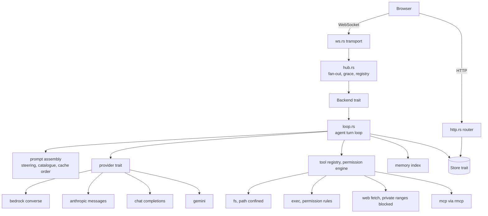

# Mezame as an agent harness

A design document for the pivot from ACP bridge to agent harness. It records
what changes, what survives, why each choice was made, and the order the work
lands in.

## Where Mezame is today

Mezame is an ACP client. It spawns a local agent binary as a child process,
speaks JSON-RPC 2.0 with it over stdio, and bridges the conversation to a
browser over WebSockets. All intelligence, credentials and session storage
belong to that agent. Mezame moves bytes.

At 0.13.4 that is roughly 4,200 lines of Rust across nine files in `src/`,
28 Rust integration test files, a React UI of roughly 6,700 lines baked into
the binary, and a CI coverage floor of 60 percent of lines.

## Where it is going

Mezame becomes an agent harness. It talks directly to LLM provider APIs, runs
its own tool-use loop, holds its own credentials, stores its own sessions, and
manages its own users, workspaces and memories.

## The constraint that governs every decision

Existing harnesses take hours to get running. Wiring a backend to a UI is
frequently the worst part, and the documentation is usually thin.

Mezame's promise is three lines:

```sh
cargo install mezame
mezame init
mezame
```

Set the config, done, in a couple of minutes. Every decision in this document
is measured against that promise. A design that is more capable and slower to
start is the wrong design for this project.

## Confirmed decisions

1. **ACP is removed entirely.** The harness lands on a `feature/harness` branch
   cut from `main` at 0.13.4. The ACP version stays available and receives no
   further development. `publish.yml` publishes from `main` only. Alphas on the
   branch install with
   `cargo install --git https://github.com/aichholzer/mezame --branch feature/harness`,
   and the first crates.io release of the harness is the one that merges. Node
   remains a build prerequisite on every path; see Deferred.
2. **Mezame holds the credentials.** API keys, Bedrock profile names and the
   rest. The README today advertises that Mezame holds no credentials of its
   own. This inverts that, deliberately.
3. **Datastore: SQLite through `rusqlite` with the `bundled` feature, behind a
   `Store` trait.** One dedicated thread owns the connection and serves `Store`
   calls over a channel; SQLite is single-writer and this serialises writes for
   free. Migrations are numbered SQL files under `src/store/migrations/`,
   embedded with `include_str!` and applied forward-only against
   `PRAGMA user_version`. Tests open an in-memory connection and run the same
   migrations; there is no separate memory store. FTS5 is compiled into the
   bundled build, so phase 6 adds no dependency. PostgreSQL arrives later as a
   second `Store` implementation, and the backend is a global setting.
4. **Multi-user schema from day one.** Every user-owned table carries
   `user_id` in the first migration. `messages` reach their user through
   `sessions`.
5. **Workspace isolation by path confinement** for 1.0, with the limitation
   documented. OS-level sandboxing is deferred.
6. **The UI stays embedded** in the binary.
7. **Bedrock first, through the AWS SDK's Converse and ConverseStream.** The
   other providers are hand-rolled over `reqwest` and one shared SSE parser. No
   other provider SDK is used.
8. **All credentials live in the datastore**, global and personal alike.
   `config.json` holds server settings only.
9. **Plugin packaging is deferred.** `mcp.json` is the extension point for 1.0.

### Why PostgreSQL waits

Writing both backends now means paying a dual-dialect tax on every query for a
PostgreSQL user who does not yet exist. Defining `Store` in phase 2 with one
implementation keeps PostgreSQL additive, with no rewrite.

### Why rusqlite and not sqlx

`sqlx` adds roughly 55 crates over `rusqlite` on today's dependency tree, and
its compile-time query checking needs a `DATABASE_URL` with the schema applied,
or committed offline query data, on every machine that compiles Mezame. That
data would have to ship inside the crates.io tarball for `cargo install` to
succeed. Hand-written SQL per backend, checked by tests against a real
in-memory database, is the lighter trade and keeps the install promise intact.

### Dependency budget

Approximate, measured with `cargo tree -e normal,build` against the 101-crate
tree at 0.13.4. Phases 0 through 2 add nothing beyond this list.

| Phase | Addition | Crates |
| --- | --- | --- |
| 1 | `aws-config`, `aws-sdk-bedrockruntime` (inherent to Bedrock-first: the credential chain is the feature) | about +121 |
| 2 | `rusqlite` bundled | +13 |
| 2 | `argon2`, `chacha20poly1305`, `arc-swap`, `tower-http` | about +19 |
| 3 | `reqwest` (first needed by web fetch; shared by the phase 4 adapters and rmcp) | about +58 |
| 5 | `rmcp` client set, `process-wrap` | mostly overlapping reqwest, rustls, hyper |
| | Union | roughly 250 |

## Two adjustments to the obvious approach

### All credentials live in the datastore

The obvious split puts global credentials in `config.json` and personal ones in
the database. That gives two storage paths, two encryption stories, a
file-to-row mapping so grants can reference a file-declared credential, and a
hot-reload requirement for provider clients. One table removes all of it.

- `credentials` holds every credential, with `user_id` null for global ones.
- `mezame init` writes the first credential straight into the datastore. Later
  ones arrive through the UI, or through
  `mezame credential add <provider> [--global | --user <name>]`.
- Provider clients are built per turn from the credential row and cached by
  credential id plus `updated`. Nothing hot-reloads; a changed key is used on
  the next turn.
- Creating a credential inserts a grant row for its creator, so the turn-time
  entitlement check is one query for every case.

Secrets are encrypted at rest under a master key at `~/.mezame/master.key`,
mode 0600. That key protects the database file when it travels alone: a copied
`.db`, a database-only dump. It does not protect a backup of the whole
`~/.mezame` directory, which contains the key, and it does not protect against
root on the machine. The documentation says so plainly.

### Bundled SQLite adds no prerequisite

`libsqlite3-sys` with the `bundled` feature compiles SQLite from C source using
the same `cc` that rustc already invokes as its linker driver on every Unix
target. Anyone who can `cargo install` anything already has it: Xcode Command
Line Tools on macOS, `build-essential` or equivalent on Linux. The compile costs
roughly fifteen to twenty seconds of one core and overlaps the rest of the
build. No mature pure-Rust SQLite exists, and none is needed.

## The install path

`cargo install mezame` requires Node.js and npm. `build.rs` runs a full `npm ci`
plus a Vite build on the installing machine, and it panics with an actionable
message when node is absent. The README documents Node 22 or newer as a
prerequisite today; the harness documents Node 24 or newer, and CI, the
container builder and `ui/package.json`'s `engines` field move to 24 with it.

The harness keeps that mechanism unchanged. Removing the Node prerequisite is
real work with a real payoff, and it sits off the critical path to a working
harness. It moves to Deferred and gets revisited once the harness does what it
should.

Two pieces of the original install plan stay here, because neither one depends on
the packaging change:

1. `rust-version` becomes 1.94.1, set by `aws-config` and
   `aws-sdk-bedrockruntime` rather than `rmcp` at 1.88. The CI `msrv` job reads
   the toolchain from `Cargo.toml` so the two cannot drift. This lands with
   phase 1 when the AWS crates arrive.
2. The Docker path is reworked in phase 0, once the Kiro subprocess is gone. The
   Dockerfile loses the Kiro CLI download and the Bun swap, and becomes a
   two-stage build: a `rust:alpine` (musl) builder with Node and npm from the
   Alpine package repository (Alpine 3.23 is the first release whose `nodejs`
   is 24, so the tag pins 3.23 or later), building from the branch source, and
   a bare Alpine runtime of the same release with `ca-certificates` and the
   binary. `/root/.mezame` is the only volume. The compose `setup` service
   runs `mezame init` only. By phase 3 compose adds a workspace bind mount, and
   stdio MCP servers that need `npx` or `uvx` are the operator's image to
   extend.

The UI stays embedded either way. Moving it out of the build would require every
user to install extra tooling and start a second process. That costs the project
its main differentiator.

## What `mezame init` asks

Three questions, and the third is optional:

1. Bind address, as today.
2. Admin username and password. The argon2id hash is written to the store, so
   the store is created here, and `init` writes `~/.mezame/master.key` with
   mode 0600. Re-running `init` never clobbers existing users. `dialoguer`
   gains its `password` feature for the masked prompt.
3. Optionally one provider: an AWS profile name and region for Bedrock, or an
   API key for one of the others, stored as a global credential. Only the
   providers that exist at that phase are offered.

Everything else happens in the UI. There is no in-browser "first visitor
becomes admin": on a `0.0.0.0` bind that is a race. Phase 0 asks question 1
only. Phase 1 has no store, so its Bedrock model id and optional profile and
region live in `config.json` for that one phase. Phase 2 adds question 2,
moves the Bedrock settings into the credentials and profiles tables, and adds
question 3.

`init` also prints the path where the built-in steering can be overridden
(see Memory and steering) so the embedded tier is discoverable.

## Current-state separation map

Established by reading the codebase. This governs the phase 0 strip.

### Survives unchanged or nearly so

- **`hub.rs`, the protocol-agnostic half** (roughly 630 of 1,238 lines):
  constants, `InflightGuard`, `Counter`, `AttachedHub`, `SessionHub`,
  `HubRegistry` attach, subscribe and remove with the per-key build mutex,
  the grace arm with the capped in-flight hold, and `_target` stamping. The
  other half is bound to `Agent` and is replaced by the seam below.
- **`run_attach_loop`** in `ws.rs`: heartbeat, half-open socket eviction,
  `_target` filtering, broadcast lag handling. Zero ACP knowledge.
- **`http.rs`**: `AppState`, the `UiAssets` embed, `run_cloudflared`,
  `enable_tcp_keepalive`, `build_router`, `shutdown_signal`, `serve_ui_asset`,
  `mime_for`, and `GET /history` with its response shape (the Kiro JSONL
  reader behind it goes; see below).
- **`/state` and `/state/events`**: survive through phase 1 as the global file
  they are today, because the two-device echo demo depends on them, and are
  rescoped to the authenticated user and backed by the store in phase 2.
- **`unix.rs`**: `send_signal`, `new_session`, `own_session`, `session_of`,
  `reap_session`, `sweep_session`. Still needed for the exec tool and for MCP
  subprocess teardown.
- **`config.rs`**: `config_path`, `state_path` (until the phase 2 `/state`
  rescoping), `load_config`, `init_config` rewritten for the new schema,
  `TransportConfig`.

The hub is the crown jewel here. It already solves multi-browser fan-out,
subscriber counting, grace teardown, and holding a turn through a mid-turn
detach with a cap on that hold. Every one of those problems exists identically
in a harness.

### Replaced in phase 0: the seam

The hub is typed on the ACP `Agent` end to end: `build_hub` spawns it and runs
`negotiate_session`, `HubLoopState` holds `agent` and the agent's `updates`
channel, the agent branch of `run_hub_loop` translates notifications through
`handle_agent_message` and a relay channel with a double serde round trip, the
loop exits when the agent dies, and shutdown calls `agent.shutdown`. All of
that is replaced by one trait the hub owns:

```rust
pub trait Backend: Send + Sync {
    /// Run one turn. Wire-shaped events (`append`, `thought`, `tool_call`,
    /// `permission_request`) stream into `events` until the future resolves.
    /// The hub derives `error` and `prompt_done` from the result; a backend
    /// never streams either, nor `ready` or `session_info`.
    fn prompt(&self, blocks: Vec<Value>, events: mpsc::UnboundedSender<Value>)
        -> BoxFuture<'_, Result<()>>;
    fn cancel(&self) -> BoxFuture<'_, ()>;
    fn permission_response(&self, id: String, option_id: String, remember: Option<Remember>)
        -> BoxFuture<'_, ()>;
    fn set_model(&self, model_id: String) -> BoxFuture<'_, Result<Value>>;
    fn history(&self) -> BoxFuture<'_, Vec<HistoryEntry>>;
    fn shutdown(&self) -> BoxFuture<'_, ()>;
}
```

The signatures are a sketch; the responsibilities are the commitment. Events
are already wire-shaped, so `HubLoopState.updates`, the relay channel and
`handle_agent_message` go. The hub is the sole producer of `ready`,
`session_info`, the user-prompt echo, `prompt_done` and `error`: it keeps the
echo (and `extract_user_text`, which derives its text), stamps `_target` from
the `attach_id` on the `Prompt` command, raises the in-flight count before the
echo, and emits `error` and `prompt_done` from the turn future's result after
draining the turn's events. A second `prompt` arriving mid-turn is dropped. The
loop no longer has an "agent exited" exit and ends only on grace or registry
removal. `attach_or_create` loses `cwd_override` (phases 0 and 1 use the
server's cwd; from phase 2 the workspace comes from the session row) and
`build_id` (moves to `handle_ws`). `register_for_test` takes an
`Arc<dyn Backend>`: a test keeps its own typed handle on the same object while
a turn is open, and the turn task holds the backend across an await.

Three implementations: `EchoBackend` in phase 0, `ScriptedBackend` for tests
from phase 0 (replays a canned event list, replacing the 80-line fake JSON-RPC
agent in `tests/hub.rs`), and `LoopBackend` wrapping `loop.rs` from phase 1.

### Deleted in phase 0

- **`src/session.rs` entirely**: Kiro lockfile handling, `try_load_session`,
  `steal_stale_session_lock`, `extract_session_info`, `short_reason`, and
  `pid_is_alive`, whose only production caller goes with it.
- **`src/agent.rs` entirely.** `rmcp` owns MCP child spawn, framing, request
  correlation, graceful shutdown and kill-on-drop. Its `process-wrap`
  dependency exposes `ProcessSession` for `setsid` and process-group kill,
  which rmcp does not apply by default, so Mezame depends on `process-wrap`
  directly and passes a `CommandWrap` wrapped with `ProcessSession` to
  `TokioChildProcess::new`. What Mezame keeps is the `/proc` session sweep in
  `unix.rs`, called with the child's pid on teardown.
- **`ws.rs`**: `PROTOCOL_VERSION`, `start_new_session`, `negotiate_session`,
  `NegotiationOutcome`, `handle_agent_message`, `run_select_loop` (already
  dead production code, reachable only from its own test file), and the
  `set_mode` arm of `parse_browser_command`.
- **`hub.rs`**: `build_hub`'s spawn and negotiate, the agent branch of
  `run_hub_loop`, `handle_command`'s body, the auto-allow ACP interception,
  `pick_allow_option`, `update_session_info_field`, `HubCommand::SetMode`, and
  the snapshot scrape that serialises negotiation frames and parses them
  straight back. `extract_user_text` stays: the hub-owned echo is derived from
  it.
- **`http.rs`**: `get_tool_result`, `find_tool_result`, `parse_kiro_history`,
  `extract_text_blocks`, `extract_thinking_blocks`, `emit_tool_use_blocks`,
  `merge_tool_results`. Not the `/history` route: see below.
- **`config.rs`**: `agent_cmd`, `agent_args`, `KNOWN_AGENTS`, `pick_agent`,
  `which`, the agent-command prompt in `init_config`,
  `read_auto_allow_permissions`, `auto_allow_from_state`, and
  `MEZAME_DEBUG_ACP` (which lives in `agent.rs`).
- **UI**: the tool-result backfill block in `useMezame.ts`
  (`backfillToolResult`, `tryFetchToolResult`, `sweepToolResultsOnPromptDone`
  and their two callers); `McpOauthCard.tsx` with the `mcp_oauth` log entry,
  `markOauthOpened` and the reducer branch; `SlashAutocomplete.tsx` whole,
  with the `commands` event, `Session.commands` and `prompts`, and the
  `SlashCommand` and `SlashPrompt` types (it is not repurposed for local
  commands: model has a picker and workspace gets one in phase 3; if phase 5
  surfaces MCP
  prompts, the component comes back from git history); the modes half of
  `ModeModelSelectors.tsx` with `set_mode`, `ModeEntry`, `SessionInfo.modes`,
  `Session.modes` and `currentModeId`, the `setMode` action and the
  `modes.length` empty-state checks in `ModeModelSelectors.tsx` and
  `InputRow.tsx`; `liveSessionId`, `resumeFailedFor` and `used` with their
  reducer branches; `Session.rememberedPermissions`, the reducer auto-resolve
  branch, the follow-up reply block and the forget and clear actions; the
  auto-allow toggle in `SettingsDialog.tsx` and `autoAllowPermissions` in
  `lib/settings.ts`. No tools exist before phase 3, so nothing that
  remembers or auto-allows permissions has a job until then.

`/tool-result` and the UI backfill go with no replacement: the loop streams
tool results itself in the `tool_call` frame. `/history` is different. It is
the UI's rehydration path on every page load, tab restore and second-device
attach: the hub broadcast never replays, `subscribe` stamps `resumed: true` on
every attach, and the client wipes its log and fetches `/history` on the first
`ready` of a tab. The route and `loadHistory` stay. Phase 0 and 1 serve it
from the backend's in-memory transcript; phase 2 serves it from `messages`.

### Tests

Tests follow their subjects. Eighteen of the 28 Rust integration test files
exercise only deleted behaviour and go with them: `agent_jsonrpc`, `agent_spawn`,
`agent_dead_agent`, `hub_dying_agent`, `auto_allow`, `config_which`,
`session_helpers`, `session_pid_is_alive`, `session_steal_stale_lock`,
`session_try_load`, `ws_handle_agent_message`, `ws_negotiate_session`,
`ws_select_loop`, `http_extract_text_blocks`, `http_extract_thinking_blocks`,
`http_find_tool_result`, `http_parse_kiro_history`, `http_tool_use_blocks`,
plus 13 of the 14 `/history` and `/tool-result` cases in `http_routes.rs`
(`get_history_without_session_param_is_400` stays; the route does).
`tests/hub.rs` (16 cases) and `ws_heartbeat.rs` (3) build their agent with
`agent::from_io` and a fake JSON-RPC responder. Fourteen hub cases are
retargeted at `ScriptedBackend` and are the regression net for grace, the
in-flight hold and `_target` filtering; `set_mode_broadcasts_updated_session_info`
and `oauth_request_is_targeted_at_the_prompter` go with the behaviour they
test. `config_paths.rs` loses its `agent_cmd` and `agent_args` assertions in phase 0
and its `state_path` assertions in phase 2 with `state.json`. Fixture patch
only: `http_routes.rs` and `http_state_events.rs` build a `Config` literal with
`agent_cmd`, and `cli_binary.rs` writes config JSON that gains `"version": 2`
in phase 2; their remaining cases are otherwise unchanged. Untouched:
`http_keepalive`, `http_mime_for`, `unix_send_signal` and `agent_reap_session`
(it tests `unix::reap_session`).

UI: `useMezame.test.ts` loses its `commands`, `mcp_oauth_request`,
remembered-permission auto-resolve and modes cases; the `Session` fixtures in `useMezame.test.ts`,
`notifications.test.tsx` and `inputRow.test.tsx` drop the removed fields;
`settings.test.tsx` loses its auto-allow cases. `useMezameSync.test.ts` dies in
phase 2 with the `/state` rescoping.

Phase 0 exits with `cargo test` and `vitest` green on the branch. The
coverage floor stays at 60 through the phase and is re-baselined at its end
from the CI job's own reading of the branch tip, rounded down minus five and
never lowered afterwards. The reference the tip is compared against is a
measurement of the merge base taken with the same command, platform, toolchain
and cargo-llvm-cov version (79.2 to 79.8 percent of lines over three runs on
2026-09-06, macOS, rustc 1.96.0, cargo-llvm-cov 0.8.7), not the
65.57 the old `ci.yml` comment quoted, which was never a measurement of that
commit.

### Widest coupling to unpick

The hub's registry key is the ACP session id, and the UI carries three ids
around it: `acpSessionId` (durable), `liveSessionId` (the fallback after a
failed `session/load`) and `ready.resumeFailedFor`, plus a `used` flag because
Kiro persists nothing until the first prompt. None of that survives. A
store-backed session either loads or errors; there is no fallback id. Mezame
mints the id in `ws_upgrade` before `attach_or_create`, so every attach has a
key and the registry's fresh-attach branch goes away (the per-key build mutex
stays: two browsers reconnecting with the same id must not build two hubs).
The UI keeps one `sessionId`; the auto-title in `deriveLabel` re-homes under
the existing numeric-placeholder check.

## Wire contract

Seven server events keep name and shape unchanged: `append`, `thought`,
`tool_call`, `permission_request` (id now Mezame-minted), `prompt_done`,
`error`, `session_info` (models half only).

Two implicit parts of the contract are made explicit. On every accepted
`prompt` the hub, not the backend, broadcasts one `append {role: 'user'}` echo
before any backend event; it is the only source of the user's own line in every
browser and the signal peer browsers use to lock their composer.
`tool_call.status` is one of `pending | in_progress | completed | failed`,
`content` is `[{type: 'text', text}]`, and `locations` is `[{path, line?}]`.

`ready` keeps its name with redefined fields: `sessionId` (Mezame-minted),
`resumed` (true on every attach to an existing hub, as today; the client still
uses it to hydrate once per tab), `cwd` until phase 3 and then
`workspace: {id, name, root}`, `promptCapabilities`
(`{image: true, embeddedContext: true, audio: false}` from phase 0 and carried
on `session_info` from phase 4 so a model switch refreshes it), `buildId`, and
`busy`, stamped per attach from the hub's in-flight count as `resumed` is
stamped today, so a browser attaching mid-turn locks its composer immediately.
`resumeFailedFor` is dropped.

Two are dropped in phase 0: `commands` and `mcp_oauth_request`. An MCP OAuth
card returns in phase 5 on the harness's own terms, with the same shape.

Four client commands survive: `prompt`, `permission_response`, `cancel`,
`set_model`. `set_mode` is deleted end to end in phase 0 with the modes
selector, its only sender. Two commands change:

- The `prompt` block shape is kept exactly: `text`, `image {mimeType, data}`
  and `resource {uri, mimeType, text | blob}` are the harness's own prompt
  vocabulary, and each provider adapter maps them (Bedrock `ImageBlock` and
  `DocumentBlock`, Anthropic `image` and `document`, OpenAI `image_url` and
  `file`, Gemini `inlineData`). The legacy `prompt.text` string is dropped;
  the UI has sent `blocks` only since attachments landed. `attachments.ts`
  and its tests are untouched.
- `permission_response` gains `remember: null | 'session' | 'workspace'`
  (phase 3).

Additions ride existing frames and need no new reducer cases:

- `permission_request` gains a stable `key` minted by the loop alongside the
  human `title` (phase 3).
- `prompt_done` gains optional `usage: {input, output, cacheRead, cacheWrite}`,
  rendered as a footer under the last agent bubble (phase 1). The hub emits
  `prompt_done`, so the backend returns usage through its turn future.
- Context compaction is `append {role: 'sys', text: '[Context compacted]'}`,
  which `LogPane` already renders as a centred pill (phase 3).
- `cancel` is acknowledged by `prompt_done`; there is no separate cancelled
  event.

`GET /history?session=<id>` keeps its path and its entry shape, frozen as:
`{role: 'user' | 'agent' | 'sys' | 'thought', text, timestamp}` and
`{role: 'tool_call', toolCallId, title, status, kind, rawInput, content,
locations, timestamp}`. The stored `messages` rows are provider-neutral blocks
(see Data model); the endpoint maps them to entries in a few lines (text to
user or agent, thinking to thought, a `tool_use` joined to its `tool_result` to
one `tool_call`).

The `_target` mechanism stays as-is. The hub stamps an `attach_id` on
permission requests, and `run_attach_loop` drops them on peer browsers. A user
only sees a permission card they were asked to answer.

`docs/wire-protocol.md` is rewritten to this contract in phase 0.

## Architecture



`ws.rs`, `hub.rs` and `http.rs` survive. Only the thing behind the hub changes,
from a subprocess to a loop.

### The system prompt

The system prompt is assembled in a fixed order from byte-stable parts:

1. An embedded preamble: identity, OS, and one short paragraph per built-in
   tool family. Per-tool guidance belongs in the tool definitions every
   provider carries, not here.
2. Built-in steering (the embedded `memory.md`, see Memory and steering),
   then server-wide steering.
3. User steering.
4. Workspace steering, including the workspace root.
5. The profile's system prompt.
6. The memory catalogue.
7. Today's date, alone on the last line.

Within a tier, files are sorted by name; a file with the same name in a
narrower tier replaces the wider one, which is the mechanism behind "narrower
scope wins". Parts are joined with a fixed separator. The date is last so that
everything before it is a stable cache prefix across days; the catalogue sits
just ahead of it because it is the part that changes most often. Phase 1 ships
the assembly function with parts 1 and 7; phase 2 adds part 5 when profiles
exist; phase 3 adds the workspace root and tool-family paragraphs; phase 6 adds
steering and the catalogue.

### Prompt caching

Every turn re-sends the tool definitions, the system prompt and the whole
conversation. Provider prompt caching is a prefix match over tools, then
system, then messages, and any byte change in the prefix re-bills everything
after it. The assembly order above exists so the prefix is stable, and the
rule that goes with it is: nothing per-turn dynamic anywhere in the system
prompt except the date on its last line, the tool list rendered in a fixed
order (built-in tools first, then MCP tools sorted by namespaced name) because
tools precede system in the cached prefix, and nothing in the catalogue that
changes unless the corpus changed.

Per provider: the Bedrock adapter inserts a `SystemContentBlock::CachePoint`
after the last static system block and a cache point after the tool list once
tools exist. The Anthropic adapter puts one explicit
`cache_control: {type: "ephemeral"}` on the last static system block and sends
the top-level request field `cache_control: {type: "ephemeral"}` that enables
the provider's automatic caching for the growing conversation; the two compose,
and the automatic breakpoint takes one of the four slots. Gemini 2.5+
and OpenAI cache implicitly on a stable prefix above their minimum; the Chat
Completions adapter sends `prompt_cache_key` = session id only when the base
URL is api.openai.com. `Usage.cache_read` and `cache_write` are stored per
message and shown in the UI. One CI-safe unit test asserts that two assemblies
from identical inputs are byte-identical, and one `#[ignore]` live test, using a
prompt above the largest minimum cacheable prefix (4,096 tokens on some current
models), asserts `cache_read > 0` on a second identical request, so a later
prompt-assembly change cannot silently disable caching.

### Stream normalisation

One internal event enum that every provider adapter emits:

```rust
enum TurnEvent {
    MessageStart { model: String },
    TextDelta(String),
    ThinkingStart { id: String },
    ThinkingDelta { id: String, text: String },
    ThinkingEnd { id: String, signature: Option<String> },
    /// A provider-opaque block (Anthropic `redacted_thinking`, Bedrock
    /// `redactedContent`, Gemini `thoughtSignature`, OpenAI encrypted
    /// reasoning). Persisted verbatim, replayed unchanged to the same
    /// provider, dropped on a provider switch.
    OpaqueBlock { raw: serde_json::Value },
    ToolUseStart { id: String, name: String },
    ToolInputDelta { id: String, json_fragment: String },
    ToolUseEnd { id: String },
    CitationDelta(Citation),
    Usage { input: u32, output: u32, cache_read: u32, cache_write: u32 },
    Stop(StopReason),
    Error { retryable: bool, message: String },
}

enum StopReason {
    EndTurn, ToolUse, MaxTokens, StopSequence,
    ContextWindowExceeded, ContentFiltered, Refusal, Other(String),
}
```

Rules that go with it:

- Tool-use events are keyed by the tool-use id, which is what reassembles
  parallel tool calls in one assistant message. Bedrock's `ToolUseBlockDelta`
  carries no id; the adapter maps content block index to id internally.
- When one assistant message carries several `tool_use` blocks, the loop runs
  them concurrently and returns every `tool_result` in one user message,
  failures as `is_error: true`. Anthropic and Bedrock reject a request whose
  `tool_use` blocks are not all answered in the next message, so results are
  never appended one message at a time.
- The loop owns JSON accumulation: on `ToolUseEnd` it concatenates the
  fragments (the first is often empty) and parses once. A parse failure
  becomes a `tool_result` with `is_error: true`, not a crashed turn.
- Thinking blocks carry their signature (interleaved thinking yields several
  per message). Signatures and opaque blocks are persisted verbatim, tagged
  with provider and model, and replayed byte for byte to the same provider.
  The stored history is append-only: providers bind thinking to the
  conversation prefix and reject edited history.
- Current Claude models send no thinking deltas unless the request asks for
  summaries. The Anthropic adapter sends
  `thinking: {type: "adaptive", display: "summarized"}` and
  `output_config.effort`, never `budget_tokens`. On Bedrock the equivalent
  goes through `additionalModelRequestFields` in the shape the model's
  current documentation requires; phase 1 sends one fixed configuration so the
  thought pane fills, and the phase 4 effort map generalises it per level.
  Without it the thought pane stays empty.
- `ImageDelta` is dropped for 1.0; no planned chat model returns image output
  here.

Confirmed against the AWS Rust SDK at 1.142.0: `ConverseStreamOutput` is
`#[non_exhaustive]` with `MessageStart`, `ContentBlockStart`,
`ContentBlockDelta`, `ContentBlockStop`, `MessageStop`, `Metadata` and
`Unknown`. `ContentBlockDelta` is `#[non_exhaustive]` with `Text(String)`,
`ReasoningContent(ReasoningContentBlockDelta)`, `ToolUse(ToolUseBlockDelta)`,
`ToolResult(Vec<ToolResultBlockDelta>)`, `Citation(CitationsDelta)`,
`Image(ImageBlockDelta)` and `Unknown`. `StopReason` is `#[non_exhaustive]`
with `EndTurn`, `ToolUse`, `MaxTokens`, `StopSequence`,
`ModelContextWindowExceeded`, `ContentFiltered`, `GuardrailIntervened`,
`MalformedToolUse`, `MalformedModelOutput`; the last two map to `Other`, the
guardrail one to `ContentFiltered`. All three require a wildcard arm, and the
fixture tests exercise it.

Reasoning streams through the same delta channel as text. That makes Bedrock
the right shape to normalise on and the right first provider.

### Provider notes

- **Bedrock** comes first, through `aws-sdk-bedrockruntime` Converse and
  ConverseStream, with `aws-config` for the credential chain (profiles, SSO,
  assumed roles, IMDS). The SDK's own retry layer handles the pre-stream
  request; the adapter configures it from the shared policy below instead of
  wrapping a second loop. Bedrock also serves current Claude models through an
  Anthropic-native Messages endpoint
  (`https://bedrock-mantle.{region}.api.aws/anthropic/v1/messages`, standard
  SSE, SigV4 or bearer token, with caching, thinking, tool use and citations).
  It is not used in 1.0; it is the route by which the phase 4 Anthropic
  adapter could later serve Bedrock too, and it is recorded under Deferred.
- **Anthropic** Messages API, with native tool use, adaptive thinking with
  summarised display, and explicit cache breakpoints.
- **OpenAI-compatible: Chat Completions, as the ecosystem adapter.** Chat
  Completions is what Ollama, OpenRouter, vLLM, Groq and LM Studio implement,
  and one adapter, configured with a base URL, covers all of them plus OpenAI
  itself. OpenAI recommends Responses for new first-party work and some newer
  reasoning features exist only there; a Responses adapter follows later if a
  user needs one of them.
- **Gemini** `generateContent` and `streamGenerateContent` with
  `functionDeclarations`, stateless, with thought signatures replayed
  unchanged as opaque blocks. Google now recommends its Interactions API for
  new work; it reached general availability in June 2026 while still served at
  `/v1beta/interactions`, and had a breaking schema change in May 2026, so 1.0
  stays on `generateContent`, which remains fully supported, and the adapter
  keeps its surface narrow enough to move later.

**No provider SDKs beyond AWS.** No official Rust SDK exists for OpenAI,
Anthropic or Gemini, and the community crates (async-openai, genai, rig-core)
are one more release cadence between Mezame and new request fields. Each of
the three HTTP adapters is `reqwest` plus one shared SSE line parser (byte
stream to `event:`/`data:` records) and hand-written request and response
structs with `#[serde(flatten)] extra: Map` so unknown fields pass through. A
multi-provider crate is rejected because Mezame must own its request and
response structs to carry thinking signatures and redacted-thinking replay,
explicit cache breakpoints, citations and Gemini thought signatures the day a
provider ships them, without waiting on a third crate's release.

Each adapter is split into a transport (request building, HTTP or SDK call)
and a pure normaliser, `fn feed(&mut self, raw) -> Vec<TurnEvent>`. Normalisers
are tested by replaying recorded SSE fixtures from `tests/fixtures/<provider>/`
for Anthropic, Chat Completions and Gemini, and by feeding
`ConverseStreamOutput` sequences built with the SDK's builders for Bedrock (its
event stream is binary and the SDK types are not deserialisable): one case per
`TurnEvent` variant plus an unknown-variant case and a mid-stream error. One `#[ignore]` live smoke test per provider runs by hand with real
credentials. CI never holds provider credentials and never bills.

### Failure, retry and cancel

Each turn carries a cancellation handle. `HubCommand::Cancel` cancels it, which
aborts the HTTP stream and any running tools. The loop then persists what it
has: completed text and thinking blocks, completed `tool_use` blocks, and the
in-progress `tool_use` only if its JSON parses. For every `tool_use` without a
result it appends a `tool_result` with `is_error: true` and content
"Cancelled by the user" in one user message, so the transcript is valid for the
next request. It then resolves the turn, and the hub emits `prompt_done`
exactly as at a normal end of turn. An assistant message with no content is
never persisted.

Requests that fail before any byte of output are retried with jittered
exponential back-off (start 1 s, cap 30 s, four attempts) on throttling,
overload, server errors and connection errors, honouring `retry-after`. A
stream that fails after output has started is not retried silently: the partial
message is persisted, the turn resolves with the error, the hub's `error`
event goes to the browser and the user decides. Retry count and last error are logged per turn.

Phase 1 ships the no-tools half of this. Phase 3 adds the tool half.

### Context management

Each model in the catalogue carries its context window and max output. Before
every request the loop estimates the prompt size from the last `Usage` (input
plus cache read plus cache write) plus the new turn. When the estimate exceeds
a fraction of the window (default 75 percent) and no tool round is open, it
compacts: the history is summarised into one message by a fixed summarisation
prompt asking for decisions, open tasks, file paths and user preferences, and
the next request carries that summary plus the new user turn and nothing else.
Compaction never edits the stored transcript: `messages` gains a nullable
`compaction_id`, the UI keeps showing the full log, and a `sys` append marks
where the model's view restarted. Switching to a smaller model triggers the
same check on the next turn. The loop also branches on
`StopReason::ContextWindowExceeded` and on the provider's over-long-input
error, since a window can be exhausted mid-generation.

Server-side compaction is deferred; one client-side path works on every
provider.

## Data model

Every user-owned table carries `user_id` from the first migration. Nothing is
retrofitted.

| Table | Columns |
| --- | --- |
| `users` | id, name, password hash (argon2id), role (`admin` or `user`), session_epoch, email (nullable, reserved for trusted-header identity), settings (JSON: theme, notifications, sendOnEnter, idleSuspendMinutes), created |
| `workspaces` | id, user_id, name, root path, permission_policy (JSON array of rules), tool_limits (JSON, nullable) |
| `sessions` | id, user_id, workspace_id, profile_id, title, archived_at (nullable, replaces the closed list), timestamps |
| `messages` | id, session_id, role, content (canonical blocks, JSON), input_tokens, output_tokens, cache_read_tokens, cache_write_tokens, compaction_id (nullable), timestamps |
| `profiles` | id, user_id (null means global), credential_id, model, thinking_effort, temperature, system prompt |
| `credentials` | id, user_id (null means global), provider, label, ciphertext, nonce, created, updated |
| `grants` | user_id, credential_id, model allowlist (JSON array, empty means all) |
| `mcp_grants` | user_id, server_name, enabled, tool_allowlist |
| `mcp_servers` | id, user_id, name, ciphertext (the `mcp.json` entry), nonce, created, updated. Personal servers only; server-wide and workspace servers stay in `mcp.json` |
| `memories` | id, user_id, workspace_id (null means the user's own scope), file path, title, summary, content hash, mtime, size, FTS index |

A profile's provider is derived from its credential. A Bedrock credential row
stores the profile name and region as its encrypted payload, or nothing for the
ambient credential chain.

Per-user UI state lives in `users.settings` and in the `sessions` table; the
sidebar's session list is `sessions` where `archived_at` is null, the recently
closed list is where it is not, and `activeId` moves to per-device local
storage.

### Canonical message blocks

`messages.content` stores Mezame's own block set: `text`,
`image {media_type, data}`, `tool_use {id, name, input}`,
`tool_result {tool_use_id, content, is_error}`,
`thinking {text, signature, provider, model}` and
`opaque {provider, model, raw}`. Tool-call ids are minted by Mezame and mapped
to the provider's id per request. On a provider switch, `thinking` and `opaque`
blocks from another provider are dropped and everything else translates 1:1.
That is the whole cost of the mid-chat switch demo. Images ride inline; a
blob table is a later optimisation if session rows grow.

### Model catalogue and effort

A static table in code per provider: id, display name, context window, max
output, image support, supported effort levels, price per million tokens.
Overridable from `config.json` for new ids. It feeds `session_info.models`,
`promptCapabilities.image`, the compaction threshold, cost display and the
entitlement allowlist. No provider listing endpoint is used; Bedrock has none
that maps to it.

`profiles.thinking_effort` is one of `off | low | medium | high | xhigh | max`.
Anthropic: adaptive thinking plus `output_config.effort`. Bedrock Converse:
`additionalModelRequestFields` per model. Chat Completions:
`reasoning_effort`, with `off` omitted. Gemini: `thinking_level`. Unsupported
levels clamp to the nearest supported one and never error.

## Entitlement model

A profile is usable only when the requesting user holds a grant covering both
its credential and its model. Enforcement happens server-side at turn time. UI
filtering on its own is not enforcement.

A worked example, from the deployment this is designed for:

- The **admin** owns global Gemini and Bedrock credentials.
- **Children** hold a grant on the global Gemini credential with a model
  allowlist restricted to one or two models. Bedrock has no grant. It stays
  invisible and unusable for them.
- A **spouse** holds grants on both global credentials with empty allowlists,
  meaning all models.
- A **later additional user** holds no grants on anything global. They create a
  personal credential, which inserts its own grant row. The admin can see that
  it exists and never its secret.

Absence of a grant is the default, for every user and every credential, with
one exception: creating a credential, global or personal, inserts a grant with
an empty allowlist for its creator. Turn-time enforcement lands in phase 4 with
the second credential; the phase 7 grants UI edits rows that already exist.

## One governing principle: files declare instructions, the database governs access

Files declare what the model is told and which servers exist:

- `~/.mezame/config.json`: server settings (bind, public URL, datastore,
  tool limits, catalogue overrides). Admin-editable through the UI,
  hot-reloaded for everything that supports it.
- `~/.mezame/mcp.json`: server-wide MCP servers. Admin-editable, hot-reloaded.
- `~/.mezame/steering/*.md`: server-wide steering, authored by an admin and
  applied to every user.
- `~/.mezame/users/<user-id>/steering/*.md`: that user's own steering, applied
  across all of their workspaces.
- `~/.mezame/users/<user-id>/memory/*.md`: that user's own memories, available in
  all of their workspaces.
- `<workspace>/.mezame/steering/*.md`: steering scoped to one workspace.
- `<workspace>/.mezame/memory/*.md`: memories scoped to one workspace.
- `<workspace>/.mezame/mcp.json`: MCP servers scoped to one workspace.

The database governs identity, secrets and access: users, credentials, grants,
profiles, sessions, messages, personal MCP servers, per-workspace permission
rules, and the derived memory index. `<user-id>` in paths is the opaque
`users.id`, so a rename touches nothing on disk.

### Three scopes, one precedence order

Steering resolves across three on-disk tiers, and memory across the last two
of them (there is no server-wide memory directory):

1. **Server-wide.** Admin-authored, applied to every user.
2. **User.** That user's own, applied across all of their workspaces.
3. **Workspace.** Applied inside one workspace.

Steering composes by concatenation in tier order, and a file with the same name
at a narrower tier replaces the wider one. That by-name replacement is the
definition of "conflict": workspace overrides user, and user overrides
server-wide. An embedded built-in tier sits below all three (see Memory and
steering).

Memory does not compose the same way. Workspace memories stay inside their
workspace and never surface in another. User memories are available everywhere
that user works, and they are how standing preferences are expressed. This is
the isolation guarantee: a memory written while working on one project does not
leak into an unrelated one.

A note on shared paths. Workspaces belong to a user in the database, and two
users may still point their own workspace at the same directory. The files under
`<workspace>/.mezame/` are then shared by whoever can read that path. Isolation
between users is enforced in the datastore and in the entitlement model.
Filesystem isolation is the operator's decision about who can reach which
directory, with one rule Mezame enforces itself: a workspace root may not be,
or contain, `~/.mezame` (compared after canonicalising both), so `master.key`,
the database and other users' directories never fall inside a confined area. A
root of `$HOME` or `/` is refused when the workspace is created. An optional
`workspaces.allowed_roots` list in `config.json` restricts non-admin users to
roots beneath the listed directories; empty means unrestricted.

### MCP configuration vocabulary

`~/.mezame/mcp.json` mirrors the Kiro vocabulary exactly. An existing config
pastes straight over: `command`, `args`, `env`, `url`, `disabled`, `timeout`,
`transport`, `oauthScopes`, `disabledTools`, `autoApprove`.

Two of those map onto Mezame concepts:

- `autoApprove` writes rules into the phase 3 permission policy engine.
- `disabledTools` drives the per-grant tool allowlist.

MCP server definitions routinely hold secrets, in `env` values and in
`Authorization` headers. A personal MCP server therefore belongs in the
encrypted datastore. A shared admin-readable file is the wrong home for one.

## Hot reload

Config changes take effect without a restart, and making them requires the
admin role. Changes arrive through the UI, which saves the file and applies it
in-process; there is no filesystem watcher, and a hand edit is picked up on
restart.

- Config moves from `Arc<Config>` to `ArcSwap<Config>` in `AppState`.
- Credentials need no reload machinery: provider clients are built from the
  credential row per turn.
- Two settings cannot hot-reload: the bind address and the datastore backend.
  The UI marks them "restart required".

## Memory and steering

Two related features with different jobs, and worth separating clearly.

**Steering** is user-authored instruction, injected into the system prompt. It is
small, deliberate and edited by hand. It answers "how should you behave".

**Memory** is accumulated fact, retrieved on demand by relevance. It grows to
hundreds of files and is never injected wholesale. It answers "what do you
already know".

Steering resolves across the three scopes above, memory across the user and
workspace scopes. Both live as markdown on disk.

### Files are the source of truth, the index is derived

The index rebuilds from files on demand. A corrupt index, a schema change, a
hand-edited file, a file moved between scope directories, and a restored backup
all resolve the same way: rebuild. That makes the index disposable, and it
means `git`, an editor, `mv` and `rm` all remain valid ways to manage memory.

Retrieval rests on two mechanisms that do most of the work:

1. **An always-injected catalogue.** Title plus a one-line summary for every
   memory, in the system prompt. Around 3 to 4k tokens at 200 memories. The
   model then knows the shape of what it remembers.
2. **`memory_search` as a tool.** The model chooses when to look and what to
   ask, and receives full text for the hits.

With those in place, keyword search suffices in most cases. The model's query
borrows the corpus's own vocabulary from the catalogue it has just read.
Semantic similarity is what blind context-stuffing depends on, and that approach
also burns context.

The catalogue is part of the cached prompt prefix and renders
deterministically: entries sorted by scope then file path, workspace entries
first, one line each (`- <title>: <summary>`), no timestamps, counts or
per-turn values. It is capped at a byte budget approximating 4k tokens; past
the budget a single line reads `N more memories; use memory_search`. A hand
edit or a `memory_write` legitimately changes the catalogue and busts the cache
exactly once.

Index refresh has three triggers and no filesystem watcher: at the start of
each turn, when the system prompt is assembled, a `readdir` plus `stat` pass
over the user's memory directory and the workspace's; a file whose mtime or
size differs from its row is re-hashed and re-indexed if the hash changed, and
rows whose file is gone are deleted. After `memory_write`, only the written
file is re-indexed. A full rebuild runs automatically when the index schema
version changes, or on admin request. A few hundred small files take a few
milliseconds at most.

### Why FTS5 first

FTS5 with BM25 ranking over a few thousand markdown files is sub-millisecond.
Speed is not the constraint at personal scale. Recall quality is the open
question, and it is measurable.

FTS5 ships with the bundled SQLite already chosen: `libsqlite3-sys` compiles
with `SQLITE_ENABLE_FTS5` unconditionally, so no extra cargo feature and no
dependence on the system SQLite's build options. The FTS table uses
`tokenize = 'porter unicode61 remove_diacritics 2'` so `deploying` matches
`deploy`; porter is English-only, so the tokenizer is a server setting with
plain `unicode61` as the alternative. `memory_search` never passes the model's
query to `MATCH` raw: each whitespace-separated term is double-quoted (embedded
quotes doubled) and joined with implicit AND, retried with OR when that returns
nothing. An FTS5 bareword may contain only letters, digits, underscore and
non-ASCII characters; `+`, `*`, `^`, `:`, parentheses, braces and `,` are
syntax, `-` is only legal as a column-filter negation, and `AND`, `OR`, `NOT`
are reserved, so the document's own example `postgres-connection-limits` would
be a syntax error unquoted.

Phase 6 ships the FTS5 index behind a `MemoryIndex` trait, alongside the
catalogue, both tools and the built-in steering file. If measured recall against
a real corpus disappoints, `sqlite-vec` slots in behind the same trait as a
hybrid ranker: BM25 and cosine similarity, fused by reciprocal rank. Embeddings
would come from one embedding model chosen by the admin in `config.json` and
billed to a global credential, exempt from per-user grants: an index needs one
vector space, and a child whose only grant is Gemini must not have their writes
billed to a credential they may not use. Vectors are computed on write and
cached by (embedding model, content hash), so a rebuild does not re-bill and a
model change invalidates every vector.

`sqlite-vec` status: stable at 0.1.9, latest 0.1.10-alpha.4, FFI over roughly
10,200 lines of C at 0.1.9. Viable, and kept off the critical path until it is known to
be needed. The bundled C build already defines `SQLITE_ENABLE_LOAD_EXTENSION`;
from Rust, `sqlite-vec` registers statically through `sqlite3_auto_extension`
via its crate, so no `load_extension` cargo feature is needed.

A local ONNX embedding model is rejected. The model download and runtime
dependency would undo the install promise.

### Memory file format

One topic per file. Front matter holds the metadata the index reads, and the
body stays short and dense.

```
---
title: Deploy pipeline
summary: Where the deploy runs, who can trigger it, and the one flag that matters
tags: deploy, ci
created: 2026-09-04
updated: 2026-09-04
---

One or two sentences of context.

- Key fact or decision
- Key fact or decision
- Source: URL or file reference
```

Front matter is a flat list of `key: value` lines between `---` delimiters,
read by Mezame's own small parser; it is not YAML and adds no YAML dependency.
Keys: `title`, `summary`, `tags` (comma-separated; `[a, b]` also accepted for
hand-written files), `created`, `updated`. There is no `scope` key: the
directory a file lives in is its scope, so a file moved between scopes needs no
edit and cannot contradict its location. Unknown keys are preserved and
ignored. The parser stays tolerant for hand-edited files.

The index stores the path, title, summary, content hash, mtime, size and the
FTS terms. The file stays authoritative.

### Memory creation ships configured

Mezame ships knowing how to manage its own memory. A working harness that has to
be taught how to remember things is an unfinished harness.

A default `memory.md` is embedded in the binary and applied as a fourth,
lowest steering tier: built-in, then server-wide, then user, then workspace.
It is never written to disk, so every release ships its current version to
every install and there is no first-run side effect and no never-overwrite rule
to code. To customise or disable the built-in behaviour, create `memory.md` at
any of the three on-disk scopes; by-name replacement means a narrower
`memory.md` replaces the built-in one, and an empty file is simply a
replacement with nothing. The built-in text is published in the docs and
`mezame init` prints the override path.

The shipped default covers six things, and the shape matters as much as the
content:

```
# Memory

How and when to record what you learn, and how to use it later.

## Before answering

Search memory when a topic may have come up before. Call `memory_search` with the
words the user used. The catalogue in your context lists every memory by title,
so check it first and search for the full text of the ones that look relevant.

## What to record

- Decisions reached together, and the reasoning behind them.
- Preferences and constraints the user stated once and will not restate.
- Corrections the user made to your assumptions.
- Where an answer lives: a file, a URL, a command. The pointer, and not a copy
  of the content.
- Project facts that took real effort to establish.

## What to leave alone

- Anything already in official documentation.
- Transient detail: the state of one task, a temporary path, a one-off value.
- General knowledge you already have.
- Credentials, tokens and keys. Never write a secret into a memory.

## When to write

Write at the moment the fact is established. Do not wait to be asked. A
correction from the user and a hard-won technical fact are each worth a memory
before the conversation moves on.

## How to write

Call `memory_write` with a topic slug (`deploy-pipeline`,
`postgres-connection-limits`), a title, a one-line summary that will appear in
your catalogue, the scope, and a short dense body: one or two sentences of
context, then bullets. One topic per file. If the catalogue already lists the
topic, `memory_search` for it and write it again under the same name with the
merged content instead of creating a second file.

Choose the scope deliberately. A fact about this project belongs to the
workspace. A standing preference belongs to the user and applies everywhere.
```

Two tools accompany it.

`memory_write` takes `name` (a slug matching `[a-z0-9][a-z0-9-]*`; Mezame
appends `.md`, and anything else is rejected and never resolved as a path),
`scope` (`user` or `workspace`), `title`, `summary` (one line, required: it is
the catalogue entry), `body`, and optional `tags`. Mezame renders the front
matter and stamps `created` and `updated`; the model never writes front matter
by hand. Writes are upserts on `(scope, name)`: the file is written to
`<name>.md.tmp` and renamed into place, the same pattern `PUT /state` uses
today, so a concurrent reader never sees a partial file. Last writer wins, and
when a write replaced an existing file the tool result echoes the previous
summary so an accidental overwrite is visible in the transcript.
`memory_write` is the only tool that writes outside the workspace root, and it
never accepts a path.

`memory_search` takes `query` and optional `limit` (default 5, maximum 10) and
returns per hit `scope`, `name`, `title` and the full body, truncated at 8 KB
per hit with a truncation note. To update a memory the model searches for it,
then calls `memory_write` with the same `name` and the merged body.

A memory write is a visible tool call. It renders as a `tool_call` card in the
UI, and the user watches what the agent chose to remember. Silent background
capture would make the feature impossible to trust or correct.

## Security posture

Stated plainly, including the limits.

- **Authentication**: argon2id password hashes. The session cookie is
  `HttpOnly; SameSite=Lax`, with `Secure` set when the request carried
  `X-Forwarded-Proto: https` or the configured public URL is https, never
  inferred from the bind address, so plain-http LAN access keeps working. The
  value is `user_id.expiry.session_epoch.hmac`, signed with a cookie sub-key
  derived from `master.key`. Lifetime 90 days, sliding: any request in the
  last 30 days re-issues it, so a phone that is used stays logged in.
  `users.session_epoch` is bumped by a password change, by `mezame passwd`
  and by an admin "log out everywhere"; a cookie with a stale epoch is
  rejected. No login-session table, no purge job. Login rate limiting is a
  per-username and per-peer fixed window in memory; argon2id at roughly
  100 ms per attempt is most of the defence.
- **Cross-site protection**: no CSRF tokens. All bodies are JSON, which axum's
  `Json` extractor already enforces, and one middleware rejects any non-GET
  request and any `/ws` upgrade whose `Origin` or `Sec-Fetch-Site` does not
  match the request host (`X-Forwarded-Host` when present, else `Host`,
  compared host-only because the tunnel terminates TLS). A request with
  neither header is rejected. That is the whole scheme, and it also closes
  cross-site WebSocket hijacking, which today's `ws_upgrade` does not check.
  A missing or expired cookie closes the socket with code 4401, which the
  client treats as "log in again" rather than a network blip to retry.
- **Isolation between users**: enforced in the datastore layer by `user_id`,
  at WebSocket attach by refusing a `?session=` the caller does not own, and
  at turn time by the entitlement model. No setting lets one user approve tool
  calls on another user's behalf.
- **Workspace confinement**: the workspace root is canonicalised once when
  registered. A tool path is joined to the root, its deepest existing ancestor
  is canonicalised and must start with the root (`std::fs::canonicalize`
  fails on a path that does not exist yet, so for a new file the parent is
  what gets checked), and the remaining components must be plain names with
  no `..`. Symlinks that resolve inside the root are allowed; anything else is
  refused with a message the model can read. A root may not be or contain
  `~/.mezame`.
- **Permissions**: every side-effecting tool (exec, fs write, web fetch, MCP
  tool) raises a `permission_request` unless a rule already covers it. Rules
  are `{tool, pattern, decision}`; exec patterns match the program name plus a
  prefix (`cargo test`, `git *`). There is no allowlist to curate before the
  first command runs: the allowlist is what the engine accumulates from the
  user's "remember" answers, from workspace policy the owner pre-seeds, and
  from `mcp.json` `autoApprove`. One enforcement point, in the loop, before a
  request is ever emitted.
- **What confinement does not do**: every user's tools run as the one Mezame
  OS user. An exec command or MCP server can read anything that user can read,
  including `~/.mezame`, whatever the workspace root says. Path confinement
  bounds the built-in filesystem tools and honest mistakes; it is not a
  security boundary between users. OS-level sandboxing is planned and not
  present in 1.0.
- **Subprocess environment**: exec commands and MCP servers inherit Mezame's
  environment minus the variables Mezame itself consumes as credentials
  (`AWS_ACCESS_KEY_ID`, `AWS_SECRET_ACCESS_KEY`, `AWS_SESSION_TOKEN`, any
  `*_API_KEY` it reads, `MEZAME_*`), then the `env` map from the MCP server
  definition is merged on top. cwd is the workspace root. This stops the
  realistic leak, an agent running `env` while debugging and the output
  landing in a transcript, without breaking SSH agents, proxies or toolchain
  paths.
- **Web fetch**: `http` and `https` only, on the fetch tool's own client
  (provider base URLs and MCP `url` entries are admin-configured and exempt).
  The host is resolved first; every answer in 127.0.0.0/8, 10.0.0.0/8,
  172.16.0.0/12, 192.168.0.0/16, 169.254.0.0/16, 100.64.0.0/10, 0.0.0.0/8,
  224.0.0.0/4, `::`, `::1`, `fc00::/7`, `fe80::/10` and the IPv4-mapped forms
  is rejected, and the connection is pinned to the resolved addresses so a
  second DNS answer cannot rebind. Redirects are followed manually with the
  same check on every hop, at most five. 30 s and 1 MB caps; `text/html` is
  reduced to text; other non-text types return metadata only; `Authorization`
  and cookies are never sent. A workspace rule may allow specific private
  hosts.
- **Tool limits**: every tool result passes through one shared cap before it
  is appended, default 64 KB kept as head plus tail with an omitted-bytes
  marker in the text the card already renders. `read_file` takes optional
  `offset` and `limit`. `exec` runs with a default timeout of 120 s, merged
  stdout and stderr under the same cap, and reports the exit code. Defaults
  are global settings in `config.json`, hot-reloaded; a per-workspace
  override rides `workspaces.tool_limits`.
- **Credentials at rest**: every credential is encrypted with
  XChaCha20-Poly1305 (`chacha20poly1305` crate), a fresh 24-byte random nonce
  per write stored beside the ciphertext, and the row id as associated data
  so a ciphertext cannot be moved between rows. The master key is 32 bytes
  from `getrandom`, written once with `create_new` and mode 0600; Mezame
  refuses to start if the file is group- or world-readable. HKDF-SHA256
  derives the `credentials` and `cookie` sub-keys from it.
- **Network exposure**: Mezame binds loopback by default. Exposing it publicly
  is the operator's decision, and putting an authenticating proxy in front
  remains supported.

## Data on disk and upgrades

`config.json` carries `"version": 2`, written by `mezame init`. A file without
it was written by the ACP version; `mezame` prints one line pointing at
`mezame init` and exits, with no silent load and no raw parse error. Alphas may
bump the version and require re-running `init`; the field makes that explicit.
`state.json` is removed by `init` in phase 2.

The datastore is `~/.mezame/mezame.db` in WAL mode. Schema migrations are
forward-only from the first alpha; a database with a newer `user_version` than
the binary is refused with a message naming both. The backup set is the
`~/.mezame` directory. Because it holds `master.key`, a whole-directory backup
is protected by the backup's own access control, not by the key; the at-rest
encryption defends the database file when it travels alone. A consistent hot
copy is `VACUUM INTO`.

## Observability

Logging stays on stderr with no logging crate, matching the journalctl and
Console.app story in `docs/service.md`. Phase 1 emits one summary line per
turn from the values already computed for the message row: session, user,
provider, model, input and output tokens, cache read and write, stop reason,
elapsed; and one line per provider error carrying the HTTP status and the
provider's request id. Phase 3 adds one line per tool call: name, decision,
elapsed, bytes. `MEZAME_DEBUG_PROVIDER=1` dumps raw provider frames with a
`[prov<-]` prefix and replaces `MEZAME_DEBUG_ACP` in `--help`, the README and
`docs/development.md`.

## Docs move with the code

Phase 0 rewrites the README except Licence and Support: the identity sections,
Kiro specifics (deleted), Features, Install (the branch form from decision 1
until the merge), Prerequisites (two bullets: a stable Rust toolchain, and
Node 24 or newer with npm; the agent bullet goes), Build from source
(mechanism unchanged), Run with Docker, Known gaps (the alpha echoes), Roadmap
and Troubleshooting; the "Why Mezame" argument is replaced with the promise
paragraph from this document. Trademarks keeps its general notice and the
non-affiliation statement and loses both Kiro passages: the sentence declaring
the mark, and the block quote identifying "the agent Mezame talks to". The same
commit changes `Cargo.toml`
`description`, `keywords` and `categories`, the title line and `ENVIRONMENT`
block of `print_help`, `docs/architecture.md` (diagram, layout, config
reference), the agent half of `docs/wire-protocol.md`, the ACP rows of
`docs/development.md`, and the three agent sentences in `docs/service.md`.
Each later phase updates the sections it changes: phase 2 removes the
no-auth statements from `docs/cloudflare.md` and `docs/architecture.md`, phase
3 documents confinement limits, phase 7 documents the admin UI.

## Phases

Every phase ends in something usable. Phases 0 through 2 hold the risk. Phases 3
onward are additive. Each phase bumps `0.14.0-alpha.N`; the version that merges
to `main` is `1.0.0`.

### Before the branch

Nothing. The branch cuts from `main` at 0.13.4 and phase 0 starts there.

### Phase 0: branch, strip, seam

New `feature/harness` branch at `0.14.0-alpha.1`, cut from `main` at 0.13.4.
Delete everything in the separation
map. Define `Backend`, ship `EchoBackend` and `ScriptedBackend`, retarget
`tests/hub.rs` and `ws_heartbeat.rs`. Mint session ids in `ws_upgrade`.
`GET /history` reads the backend's transcript. `mezame init` asks for the bind
address only. The Dockerfile and compose rework, per the install path section.
CI runs on the branch and installs Node 24. Docs move with the code.
`cargo test` and `vitest` green.

**UI**: the deletions listed in the separation map; `acpSessionId` collapses
to `sessionId`; the cwd affordance goes whole (the `?cwd=` query parameter,
`Session.cwd`, the new-session dialog's directory field and the chip's edit
path), leaving `CwdChip.tsx` as a display of the `cwd` the `ready` event
reports; `docs/wire-protocol.md` rewritten.

**Demo**: a browser connects, sends a prompt, and sees an echo, on two devices,
with grace teardown intact, and a reload shows the transcript. This proves the
transport survived the amputation.

### Phase 1: Bedrock end to end, no store

Converse and ConverseStream through the AWS SDK, `TurnEvent` normalisation
with builder-constructed stream tests, a fixed thinking configuration so the
thought pane fills, the turn loop with no tools, the system prompt assembly
function with its preamble and date, the no-tools half of failure, retry and
cancel, prompt caching with a system cache point, `prompt_done.usage`, the
per-turn log line. The transcript lives in the hub for the hub's lifetime and
serves `/history`. Bedrock model id and optional profile and region in
`config.json` for this phase only; credentials from the ambient AWS chain.
Loopback, no auth: the same posture 0.13 ships with. `rust-version` to 1.94.1
and the `msrv` job with it.

**UI**: the usage footer under the last agent bubble.

**Demo**: a real streaming conversation with reasoning shown in the thought
pane; open it on a phone mid-turn and watch the same stream; a second
identical request reports cache reads.

### Phase 2: store, auth, persistence

The `Store` trait, `SqliteStore`, the first migration with every table. The
migration also creates one default workspace per user with the server's cwd as
its root, so every session has a `workspace_id` before the phase 3 picker
exists and `ready.cwd` is that root; when the cwd is `/`, `$HOME` or contains
`~/.mezame`, no default is created and the filesystem and exec tools stay off
for that user until a root is chosen. `messages` persisted from the phase 1
model; `/history` served from the store;
`/state` and `/state/events` rescoped to the authenticated user and backed by
`sessions` and `users.settings`, `state.json` and `state_path` deleted; `ws_upgrade` refuses a
`?session=` the caller does not own. Argon2id, the cookie, the Origin check,
rate limiting, close code 4401. `mezame init` creates the admin and the master
key and asks for the first credential; `mezame user add <name> [--admin]`,
`mezame user list` and `mezame passwd <name>` operate directly on the store; a
datastore with zero users falls into the bootstrap prompt exactly as a missing
config falls into `init` today. Config moves to `ArcSwap`. `config.json`
version 2.

**UI**: no router. A module-level auth state behind `useSyncExternalStore`
and one `apiFetch` wrapper that flips it on 401; `App.tsx` renders a login
gate until authenticated and calls `init` after; a logout button in the
sidebar footer. `useMezame.ts` loses `mergeSessionsForSync`, the read-then-merge
in `doSync`, `shouldCloseAbsentSession`, `nextLabel`, `suppressNextSync` and
the `closed` array; reconciliation reduces to applying the server's list.
`settings.ts` persists with a plain PUT. `useMezameSync.test.ts` goes.

**Demo**: log in; a conversation survives a restart and a reload and follows
the user to a phone; an unauthenticated request gets 401; a second user
created from the terminal sees none of the first user's sessions.

### Phase 3: tools, permissions, workspaces, context

Path-confined filesystem tools, exec, web fetch with its private-range rules,
the permission policy engine with `key` and `remember`, workspace roots with
the `~/.mezame` rule and per-workspace policy, tool result caps and timeouts,
the subprocess environment rule, the tool half of failure and cancel, context
management with compaction, the per-tool log line, and loop limits:
`max_tool_rounds` per turn (default 25) and a per-turn output cap, with a
visible `sys` notice when a cap ends a run.

**UI**: the client sends `?workspace=<id>` on connect (phase 0 removed
`?cwd=`); `effectiveCwd` becomes `workspace`; `CwdChip.tsx`, a display of the
server's directory since phase 0, becomes a workspace picker over the generic
`Picker` from `ModeModelSelectors.tsx`, with a "Manage" item for root path and
rules; `NewSessionDialog.tsx` gains the same picker in place of the directory
field phase 0 removed; the permission card's checkbox returns wired to
`remember` with a session-or-workspace scope toggle.

**Demo**: the agent edits a file inside a workspace and is refused outside it;
a decision remembered on the phone holds on the laptop; a runaway loop stops at
the cap; a long session compacts and continues.

### Phase 4: providers, profiles, and the screens they need

Anthropic, Gemini, and the Chat Completions adapter covering OpenAI plus
compatible endpoints, each with fixture tests. Canonical message translation
per provider, the static model catalogue, the effort map, image mapping,
cost from the price table. Profile CRUD and credential CRUD in the UI (three
keys are needed at once here for the first time), default selection, and
mid-conversation switching through the existing `session_info` and
`set_model` path: `availableModels` lists the profiles the user is entitled
to, `modelId` carries the profile id, and the picker's label becomes
"Profile". `promptCapabilities` rides `session_info`.

**Demo**: paste an API key in the UI, switch provider mid-chat, and continue
the same conversation.

### Phase 5: MCP

`rmcp` with `default-features = false` (the defaults pull the server and its
macros) and `client`, `transport-child-process`,
`transport-streamable-http-client`, `transport-streamable-http-client-reqwest`,
`auth`. The `mcp.json` reader with hot reload, `mcp_grants` enforced
server-side when the tool registry is built, tool namespacing, `autoApprove`
writing into the permission rules, `unix::reap_session` on teardown, and the
OAuth card.

**Demo**: add a server to `mcp.json`; its tools appear on the next turn with
no restart.

### Phase 6: memory and steering

Steering resolution across the four tiers with by-name replacement. Memory as
markdown with front matter, the FTS5 index behind the `MemoryIndex` trait with
the porter tokenizer and query quoting, the byte-stable capped catalogue in
the system prompt, the stat-pass refresh, `memory_write` and `memory_search`
with their contracts, and the built-in `memory.md` as the lowest tier.

**Demo**: the agent recalls a fact from a previous session in the same workspace,
a second workspace does not see it, a standing preference written at user
scope applies in both, and the second turn after a write reports cache reads
again.

### Phase 7: users, grants, admin

User administration, grants with model allowlists, MCP grants, personal
credentials and personal MCP servers, "log out everywhere", hot-reload for
everything that supports it, and a clear "restart required" marker for the
rest. Optional trusted-header identity: validate Cloudflare Access's
`Cf-Access-Jwt-Assertion` against the team JWKS and map `email` to
`users.email`, so tunnel users log in zero times.

**Demo**: grant a user Bedrock access without touching a terminal; each user
sees only their own sessions.

Then `1.0.0`.

## Deferred

Planned and out of scope for 1.0.

**A Node-free install.** `cargo install mezame` would need a Rust toolchain
alone, with the UI built in the publish pipeline. `Cargo.toml` swaps its
`exclude` list for an `include` list covering `src/**`, `build.rs`, `README.md`,
`LICENSE` and `ui/dist/**`. Dropping the `ui/dist/**` exclude entry alone does
nothing, because with `include` absent cargo skips every gitignored path
regardless of `exclude`. `vite.config.ts` writes the id it baked into
`__MEZAME_BUILD_ID__` out to `dist/.build-id`, and `build.rs` takes a prebuilt
path when `ui/dist/index.html` exists and `ui/package.json` does not, which is
exactly the packaged crate. CI uploads `ui/dist` from `ui-tests` and asserts the
release binary contains that build id. Alongside it: one `icon.png` for the
favicon, the touch icon and both manifest entries, KaTeX's `.ttf` and `.woff`
fallbacks out of the bundle, and `[profile.release]` to `lto = "thin"` with no
`codegen-units` pin.

One question decides whether the build id survives the trip into the crate, and
it is unanswered: whether cargo's `include` globs package a dot-prefixed file
inside an included directory. Settle that before anything else here.

**OS-level sandboxing for tool execution.** Linux namespaces and seccomp, macOS
`sandbox-exec`. Phase 3 ships path confinement only. This supersedes it, and it
complicates spawning MCP servers.

**Vector-backed memory retrieval** behind the `MemoryIndex` trait, gated on
measuring FTS5 recall against a real corpus first.

**Plugin packaging.** A bundle of an MCP server plus a manifest, installable
from the UI. Everything it would do is an `mcp.json` entry today, and an
installer that downloads and runs code is a supply-chain surface that needs
review before it ships. Gated on demand from a real deployment.

**Anthropic on Bedrock through the Messages endpoint.** Bedrock's
`/anthropic/v1/messages` endpoint takes the first-party request body over
standard SSE with SigV4. Pointing the Anthropic adapter at it, with
`aws-sigv4` for signing, would let one adapter serve both and retire the
Converse adapter for Claude models. Kept as an option once phase 4 exists;
Converse remains the path for non-Anthropic Bedrock models.

**OpenAI Responses adapter**, stateless with reasoning items replayed as
opaque blocks, when a user needs a feature Chat Completions lacks.

**Server-side compaction** on providers that offer it. One client-side path
works everywhere and is enough for 1.0.
