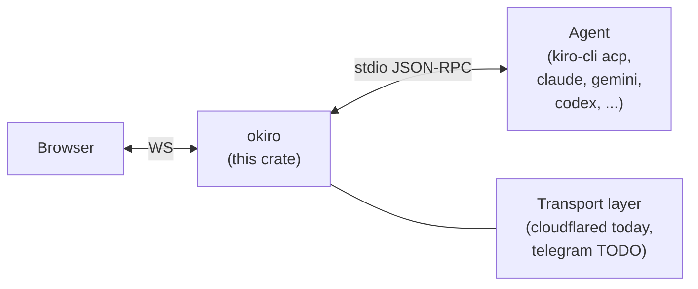

# Okiro!

*Wake your Kiro from anywhere.*

A small Rust bridge that puts a browser-based chat UI in front of a
locally running ACP agent (Kiro CLI, Claude Agent CLI, Gemini CLI, Codex,
or anything else that speaks the [Agent Client Protocol][acp] over
stdio).

[acp]: https://agentclientprotocol.com

The name is Japanese for "wake up" (起きろ), which is what you do to your
agent when you page it from across town. It also happens to contain
"kiro", which is nice.

## What it does, in one paragraph

`okiro` is an **ACP client**. When a browser connects, `okiro` spawns
your configured agent binary as a child process and speaks JSON-RPC 2.0
with it over stdio. User messages from the browser become `session/prompt`
requests; `session/update` notifications from the agent stream back to
the browser as chat turns. The agent keeps its own credentials and model
choice; `okiro` carries none.

## Architecture



- One browser WebSocket connection = one `okiro` session = one freshly
  spawned agent subprocess = one ACP session.
- `okiro` listens only on `127.0.0.1`. Public reachability is delegated
  to an existing Cloudflare Tunnel on your network.
- The web UI is a React + Tailwind v4 + shadcn app under `ui/`. A
  `build.rs` step runs the Vite build; the compiled bundle is baked into
  the binary via `rust-embed` so the release binary stays self-contained.

## File layout

```
Okiro/
├── Cargo.toml
├── Cargo.lock
├── CHANGELOG.md
├── LICENSE
├── build.rs                    # runs `npm ci` + `npm run build` in ui/
├── src/
│   └── main.rs                 # config, ACP bridge, transports, HTTP
├── ui/                         # React UI (Vite, TS, Tailwind v4, shadcn)
│   ├── index.html
│   ├── package.json            # UI version lives here
│   ├── vite.config.ts
│   └── src/
│       ├── App.tsx
│       ├── main.tsx
│       ├── index.css
│       ├── types.ts            # wire-protocol and state types
│       ├── hooks/useOkiro.ts   # store, WS lifecycle, state sync
│       ├── features/           # TabBar, LogPane, InputRow, ...
│       ├── components/         # CopyButton + shadcn primitives
│       └── lib/                # utils, time helpers
```

## Quick start

```sh
cargo build --release
./target/release/okiro
```

`cargo build` invokes the UI build as part of `build.rs`, which requires
`node` and `npm` on `PATH`. First build also seeds `ui/node_modules` via
`npm ci`; subsequent builds are cache hits and mostly free.

First launch without config drops into an interactive setup and writes
`~/.okiro/config.toml`. Re-run setup any time:

```sh
./target/release/okiro init
```

Then point a browser at `http://127.0.0.1:7842` to smoke-test locally,
or at your public hostname once the tunnel is wired.

## Versioning

We track versions in three places that MUST stay in sync:

- `Cargo.toml` → `package.version`
- `ui/package.json` → `version`
- `CHANGELOG.md` → heading of the top-most release section

The UI bundle surfaces its version in the top-right of the header via a
Vite `define`. Start from `0.1.0`, follow SemVer from there.

## Configuration reference

`~/.okiro/config.toml`:

```toml
# Transport picks how clients reach okiro.
#   "cloudflared" — serves HTTP + WebSocket on `bind`, for an external tunnel.
#   "telegram"    — stub; long-polls a Telegram bot. Not yet implemented.
transport = "cloudflared"

# Local bind address. Keep it on loopback; public exposure is the tunnel's job.
bind = "127.0.0.1:7842"

# Command to launch the ACP agent. Either a bare name (resolved via $PATH) or
# an absolute path. For Kiro: `kiro-cli` with args ["acp"].
agent_cmd = "kiro-cli"
agent_args = ["acp"]

[telegram]
# Only used when transport = "telegram". Create with @BotFather.
token = ""
```

### Agent command examples

| Agent | `agent_cmd` | `agent_args` |
|-------|-------------|--------------|
| Kiro CLI | `kiro-cli` | `["acp"]` |
| Claude Agent CLI | `claude` | check your install; may be `["acp"]` or similar |
| Gemini CLI | `gemini` | check your install |
| Codex | `codex` | check your install |

Confirm a working invocation by running it manually; a healthy ACP agent
prints nothing to stdout until it receives a JSON-RPC message on stdin.

## Expose via Cloudflare Tunnel

A named Cloudflare Tunnel can route a public hostname at your local
`okiro`. The setup differs slightly depending on whether you already run
`cloudflared`.

### Starting from scratch

1. Install `cloudflared` and authenticate:

   ```sh
   cloudflared login
   ```

2. Create a tunnel. The name is yours to pick; Cloudflare returns a UUID
   and writes credentials to `~/.cloudflared/<UUID>.json`:

   ```sh
   cloudflared tunnel create okiro
   ```

3. Create `~/.cloudflared/config.yml` with the following contents,
   replacing `REPLACE_WITH_TUNNEL_UUID` with the UUID from step 2 and
   `okiro.example.com` with your hostname. WebSocket upgrades are
   forwarded by default; no extra flags needed.

   ```yaml
   tunnel: REPLACE_WITH_TUNNEL_UUID
   credentials-file: ~/.cloudflared/REPLACE_WITH_TUNNEL_UUID.json

   ingress:
     - hostname: okiro.example.com
       service: http://localhost:7842
     - service: http_status:404
   ```

   The `tunnel:` value must match the tunnel you created; if it does
   not, `cloudflared` refuses to start.

4. Route the hostname to the tunnel from the machine that owns the
   credentials:

   ```sh
   cloudflared tunnel route dns okiro okiro.example.com
   ```

5. Run it:

   ```sh
   cloudflared tunnel run okiro
   ```

   or install it as a system service with `cloudflared service install`.

### Adding okiro to an existing tunnel

If you already have `cloudflared` running (Proxmox LXC, Docker, systemd
unit, whatever), keep your current config and add one ingress rule
above the catch-all:

```yaml
ingress:
  # ... your existing rules above ...
  - hostname: okiro.example.com
    service: http://<host-running-okiro>:7842
  # keep the catch-all last
  - service: http_status:404
```

Route the hostname once:

```sh
cloudflared tunnel route dns <your-tunnel-name> okiro.example.com
```

Reload `cloudflared`. WebSocket upgrades are forwarded by default, so
`/ws` needs no special flags.

## Put Cloudflare Access in front (strongly recommended)

Once a public hostname points at `okiro`, anyone who finds the URL can
drive your local agent. Treat this as non-optional:

1. Cloudflare Zero Trust, Access, Applications, Add application,
   Self-hosted.
2. Application domain: `okiro.example.com`.
3. Policy: allow only your email, passkey, or IdP identity.

Access injects a signed `Cf-Access-Jwt-Assertion` header on every
request. Validating it in `okiro` is still a TODO (see *Known gaps*).

## HTTP endpoints

| Method | Path | Purpose |
|--------|------|---------|
| `GET` | `/` and anything not otherwise matched | Serve the embedded React UI (SPA fallback to `index.html`). |
| `GET` | `/assets/*` | Content-hashed UI assets, served from the embedded bundle with a 1-year immutable cache. |
| `GET` | `/state` | Return persisted UI state (open tabs, history, next-label counter). `{}` if nothing stored. |
| `PUT` | `/state` | Atomically replace the UI state (writes to `.tmp` + `rename`). |
| `GET` | `/history?session=<id>` | Reconstructed chat history from Kiro's on-disk `~/.kiro/sessions/cli/<id>.jsonl`, with real per-turn timestamps. Returns `{ entries: [{ role, text, timestamp }] }`. |
| `GET` | `/ws` (WebSocket) | Per-browser session. Query params: `session=<acp-id>` to resume, `cwd=<abs-path>` to override the agent cwd. |

## Wire protocol

### Browser to okiro (JSON text frames over `/ws`)

```json
{ "type": "prompt", "text": "hello" }
{ "type": "cancel" }
{ "type": "permission_response", "id": <original id>, "optionId": "allow_once" }
{ "type": "set_mode", "modeId": "kiro_planner" }
{ "type": "set_model", "modelId": "claude-sonnet-4.5" }
```

### okiro to browser

```json
{ "type": "ready", "sessionId": "<uuid>", "resumed": true | false }
{ "type": "session_info", "info": { "modes": { "currentModeId", "availableModes": [...] },
                                    "models": { "currentModelId", "availableModels": [...] } } }
{ "type": "commands", "commands": [...], "prompts": [...] }
{ "type": "append", "role": "user" | "agent" | "sys", "text": "..." }
{ "type": "prompt_done" }
{ "type": "permission_request", "id": <original id>, "title": "...", "options": [...] }
{ "type": "error", "message": "..." }
```

Details:

- `ready` fires once per (re)connect. `resumed: true` means the browser
  should clear the active log and seed from `/history`. The browser
  persists the `sessionId` so the next reconnect can pass
  `?session=<id>`.
- `session_info` arrives immediately after `ready` whenever Kiro
  reported `modes` / `models` on `session/new` or `session/load`. Drives
  the mode and model selectors in the header.
- `commands` forwards Kiro's `_kiro.dev/commands/available` catalogue
  (commands + prompts only; the massive tool catalogue is stripped on
  the server to keep WS frames light). Drives the `/` autocomplete.
- `append` is the ACP streaming path for a live turn. During a resume
  window the server suppresses these so the browser's `/history`-seeded
  log doesn't get duplicated.
- `permission_request` renders an inline card with one button per
  option; the user's click returns a `permission_response` with the
  matching `optionId`, which `okiro` forwards to the agent to unblock
  it.
- `cancel` triggers `session/cancel` on the agent.

### Cross-device UI state

`GET` / `PUT /state` persists the open-tabs list, recently-closed
history, active tab, and numeric label counter. Backing file is
`~/.okiro/state.json`. Any browser hitting this okiro sees the same
list, useful when moving between devices behind the same tunnel. Actual
conversation content stays with the agent (Kiro at
`~/.kiro/sessions/cli/`); okiro only stores labels, cwds, and ACP
session ids.

### okiro ↔ agent (stdio, ACP JSON-RPC 2.0)

Requests `okiro` sends:

- `initialize` on spawn.
- `session/new` when the browser opens a fresh tab.
- `session/load` when the browser reconnects with `?session=<id>`. With
  recovery: retries the load with 250 ms back-off while the error is
  "Session is active in another process", stealing the lockfile whenever
  the holding PID is dead. Covers the browser-reload race and the
  stale-lock case after a dirty shutdown.
- `session/prompt` for each user message.
- `session/cancel` (notification) for explicit cancel and during
  cooperative shutdown.
- `session/set_mode`, `session/set_model` when the user picks a new
  value in the header.

Notifications `okiro` handles:

- `session/update`:
  - `agent_message_chunk` to `append` with `role: "agent"`. Rendered as
    markdown in the chat pane.
  - `user_message_chunk` to `append` with `role: "user"` during
    `session/load` replay (suppressed when we're seeding from
    `/history`, see above).
  - `agent_thought_chunk` to `append` with `role: "sys"` and a
    `(thinking)` prefix. Kiro itself does not emit these today;
    reasoning-model agents do.
  - `tool_call` / `tool_call_update` to sys line `[title, status]`.
- `session/request_permission` to `permission_request` event for the
  browser.
- `_kiro.dev/commands/available` to `commands` event (trimmed to
  `commands` + `prompts`).

Other `_kiro.dev/*` notifications (MCP OAuth URL, compaction status,
clear status) are currently ignored. Extension points live in
`handle_agent_message` in `src/main.rs`.

## Running the binary directly

```sh
cargo build --release
./target/release/okiro           # run
./target/release/okiro init      # re-run setup
```

Stderr carries `okiro`'s own logs and, prefixed with `[agent]`, the
agent's stderr. Useful env vars:

- `KIRO_LOG_LEVEL=debug`, passed through to the spawned `kiro-cli acp`
  child for Kiro-side tracing.
- `OKIRO_DEBUG_ACP=1`, dump every inbound ACP line from the agent to
  `okiro`'s stderr with an `[acp<-]` prefix. Helpful when wiring new
  Kiro extensions.
- `OKIRO_SKIP_UI_BUILD=1`, tell `build.rs` not to run the UI build. You
  are then responsible for making `ui/dist/` present yourself (e.g. by
  running `npm run build` in `ui/`). Saves ~5 s on Rust-only iteration.

## Known gaps (pick up here)

1. **Auth enforcement.** `okiro` trusts everything that reaches the
   WebSocket upgrade. When fronted by Cloudflare Access, validate the
   `Cf-Access-Jwt-Assertion` header (JWKS at
   `https://<team>.cloudflareaccess.com/cdn-cgi/access/certs`). See
   `ws_upgrade` in `src/main.rs` and the backlog in `todo.md`.
2. **Telegram transport.** `run_telegram` is a stub. Planned shape:
   long-poll `getUpdates`, one ACP agent per Telegram chat, stream
   chunks as `editMessageText` throttled to ~1/s, inline keyboard for
   permission prompts. Per-user-token model (BotFather) keeps `okiro`
   out of the data path.
3. **Remaining Kiro extensions.** MCP OAuth URL (needs user redirect)
   and compaction / clear status notifications are still dropped.
   Slash commands and the commands catalogue are surfaced.
4. **Streamable HTTP remote transport.** ACP's draft RFD defines an
   HTTP/WS remote transport with `Acp-Connection-Id` and
   `Acp-Session-Id` headers; today `okiro` is purely a local stdio
   client. Once the RFD stabilises and agents support it, `okiro` can
   become a thin remote adapter too.

Everything else proposed (markdown polish, exports, keyboard shortcuts,
mobile layout, per-tool allow/deny, etc.) lives in `todo.md`.

## Development guide

### Toolchain

- Rust edition 2021, MSRV follows the current stable toolchain.
- Node.js and npm (tested on Node 24); versions in `ui/package.json`.

### Build, check, lint

```sh
cargo check
cargo build --release
cargo clippy --all-targets -- -D warnings   # gate on this in CI
```

Inside `ui/`:

```sh
cd ui
npm ci
npm run build   # emits ui/dist/
```

### Dev loop

Two terminals:

```sh
# terminal 1: Rust on :7842
cargo run --release

# terminal 2: Vite with HMR on :5173, proxies /ws, /state, /history
cd ui
npm run dev
```

Browse `http://127.0.0.1:5173`. The embedded bundle is only relevant
when you run the release binary directly.

### Where to add things

| Change | File and function |
|--------|-------------------|
| New `session/update` variant | `handle_agent_message` in `src/main.rs` |
| New browser to okiro message type | WS `select!` arms in `handle_ws` in `src/main.rs` |
| New okiro to browser message type | Emit from the WS handler; type in `ui/src/types.ts`; handle in `handleMessage` in `ui/src/hooks/useOkiro.ts` |
| Auth middleware | wrap `Router` in `run_cloudflared` or apply to the `/ws` route |
| New transport (telegram, matrix, ...) | mirror `run_cloudflared`; add variant to the `Transport` enum |
| UI tweak | edit under `ui/src/`; `npm run dev` for HMR or full `cargo build` for the embedded path |

### Testing

There are no tests yet. Practical coverage to add:

- **Config round-trip.** Property test that `Config` survives
  `toml::to_string_pretty` to `toml::from_str`.
- **JSON-RPC routing.** Unit test the reader task: feed it a mix of
  responses (by id), notifications, and malformed lines, assert the
  right routing.
- **End-to-end smoke.** Spawn `okiro` with `agent_cmd = "bash"` and
  `agent_args = ["-c", "<echo canned JSON-RPC>"]` as a fake agent.
- **History parser.** Feed `parse_kiro_history` a representative
  `.jsonl` fragment; assert timestamps propagate from `Prompt` to the
  subsequent `AssistantMessage` entries.

### Debugging

- `cargo run --release` prints the bind address on stderr and forwards
  the child's stderr with `[agent]` prefix.
- `OKIRO_DEBUG_ACP=1` shows every inbound JSON line with `[acp<-]`.
- Run the agent manually first to confirm the invocation works:
  `echo '{"jsonrpc":"2.0","id":1,"method":"initialize","params":{}}' | kiro-cli acp`
  should respond with JSON.
- Browser devtools, Network, WS view shows every frame in both
  directions.

## Troubleshooting

**`failed to spawn kiro-cli`**
 `agent_cmd` not on `$PATH`. Use `which kiro-cli` and put the absolute
 path in `~/.okiro/config.toml`.

**`cargo build` fails with "npm not found"**
 `build.rs` requires `node` and `npm`. Install Node.js, or set
 `OKIRO_SKIP_UI_BUILD=1` and produce `ui/dist/` yourself.

**Browser connects, no response after send**
 Check the `[agent]` lines on `okiro`'s stderr. Most often the agent is
 prompting for an auth/setup step that only appears in interactive
 TTYs. Finish setup by running the agent once interactively first.

**`[previous session X could not be resumed (...)]`**
 The browser tried to resume via `session/load` and Kiro refused.
 Either the session file is gone from `~/.kiro/sessions/cli/`, or a
 live process still holds the lock. `okiro` retries with exponential
 back-off (~1.25 s budget) and steals stale-PID locks automatically.
 If you see this message persistently, there is a genuine conflict:
 check `ps` for another Kiro process holding that session, or delete
 the `.lock` file manually.

**Cloudflare hostname returns 502**
 The `cloudflared` machine cannot reach the `okiro` machine. Check
 `service: http://<host>:7842` in the ingress rule resolves and the
 port is open on the `okiro` host.

**WebSocket closes immediately**
 Cloudflare Access policy is rejecting the upgrade. Hit the hostname
 in a browser first to satisfy Access, then retry.

## Licence

[MIT](./LICENSE).
