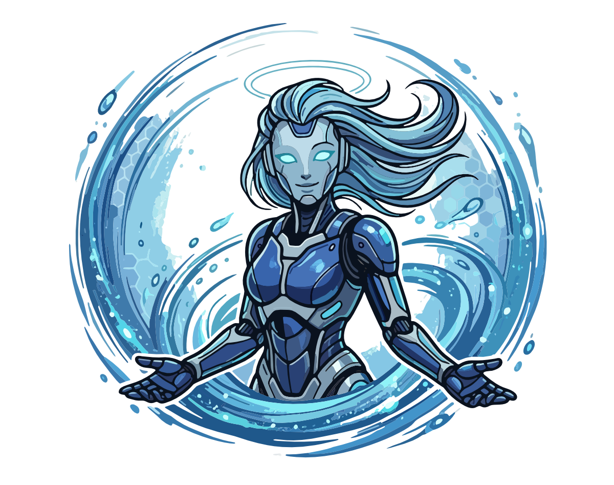

<div align="center">
  
</div>

# Okiro!

_Wake your agent up from anywhere. Anytime._

A small Rust bridge that puts a browser-based chat UI in front of a locally running ACP agent (Kiro CLI, Claude Agent CLI, Gemini CLI, Codex, or anything else that speaks the [Agent Client Protocol][acp] over stdio).

[acp]: https://agentclientprotocol.com

The name is Japanese for "wake up" (**起きろ**), which is what you do to your agent when you page it from across town.

## What it does

Okiro is an **ACP client**. It spawns your configured agent binary as a child process, speaks `JSON-RPC 2.0` with it over `stdio`, and bridges the conversation to a browser over WebSockets. The agent keeps its own credentials and model choice; Okiro carries none.

> **Tested with Kiro CLI.** The protocol surface is standard ACP, so any stdio-speaking agent should work for the core loop (prompt, stream, cancel, permissions, modes, models). A few features lean on Kiro-specific extensions and disk layout: chat history rehydration reads `~/.kiro/sessions/cli/<id>.jsonl`, slash-command autocomplete consumes the `_kiro.dev/commands/available` notification, and stale-lock recovery targets Kiro's lockfile convention. Claude Agent CLI, Gemini CLI, Codex, and others should connect, but are currently untested; expect missing command autocomplete and no history replay on resume. **Bug reports are welcome.**

## Why Okiro

There are plenty of tools that let you drive an LLM from the couch. Most of them fall into one of two shapes:

1. **Direct-to-provider gateways.** They talk to Bedrock, Anthropic, OpenAI, or Google themselves. You hand them API keys, provision users, manage roles and quotas, and store credentials somewhere they can reach. The tool becomes another auth surface you have to look after.
2. **Remote UIs for a local agent CLI.** These front a locally-running agent process, which is closer to what I wanted. Some of them still ask you to generate access tokens, configure users, or wire up a separate auth flow between the browser and the bridge itself.

Okiro deliberately does less than either. It is an **ACP pipe**, nothing more:

- Your local agent (Kiro, Claude, Gemini, Codex, whatever...) already handles its own login, its own model choice, its own credentials, and its own session storage. That solved problem stays solved.
- Okiro never sees an API key. It does not know what the agent authenticates to, and does not want to.
- Access control for the browser is pushed to the edge: bind an address in your network, put a Cloudflare Tunnel in front, let Cloudflare Access gate the hostname with your existing identity provider. You already trust that stack with the rest of your self-hosted tools.

**The net effect:** if your agent is signed in locally, you can talk to it from anywhere your tunnel reaches. If it is not, Okiro has nothing useful to offer. That is the whole trade.

## Features

- Multiple concurrent sessions as browser tabs, each backed by its own agent.
- Session persistence across browser reloads and server restarts.
- Cross-device state sync. Any browser hitting the same Okiro instance sees the same tabs and recently-closed history.
- Recently-closed history (up to 20 entries) with one-click restore.
- Session resumption with automatic recovery from stale lockfiles.
- Per-session working directory override (`?cwd=<abs-path>`), so different tabs can target different directories.
- Cooperative cancel of the active turn.
- Auto-reconnect with exponential back-off on WebSocket drops.

## Install

```sh
cargo install okiro
okiro init
okiro
```

Then point a browser at `http://127.0.0.1:9510` (or whatever IP and port you set) to run locally, or at your public hostname once your tunnel is wired.

### Prerequisites

- **Rust** toolchain, stable. [rustup][rustup] or your distro's package manager.
- **Node.js** 22 or newer with `npm` on `PATH`. Installing Okiro builds the embedded React UI as part of `build.rs`; the install fails fast if `node`/`npm` are missing.
- **An ACP-capable agent** on `PATH`: Kiro CLI, Claude Agent CLI, Gemini CLI, Codex, etc. `okiro init` probes for known CLIs and offers them in a menu.

[rustup]: https://rustup.rs
[nvm]: https://github.com/nvm-sh/nvm

`cargo install` will install the binary to `~/.cargo/bin/okiro`. The UI bundle is baked into the binary. No need for Node.js at runtime.

## Docs

- [Architecture and layout](./docs/architecture.md): diagram, file layout, config reference.
- [Running as a service](./docs/service.md): systemd (Linux) and launchd (macOS) units so Okiro starts at boot.
- [Cloudflare Tunnel and Access](./docs/cloudflare.md): step-by-step for exposing Okiro publicly and gating it with an identity provider.
- [Wire protocol](./docs/wire-protocol.md): browser to Okiro and Okiro to agent message catalogue.
- [Development](./docs/development.md): build, dev loop, where to add things, debugging.

## Build from source

Alternative to `cargo install`. Useful when you're iterating on Okiro itself or want to run a branch. Same prerequisites apply.

```sh
git clone https://github.com/aichholzer/okiro
cd okiro
cargo build --release
./target/release/okiro           # run
./target/release/okiro init      # re-run setup
```

`cargo build` invokes the UI build as part of `build.rs`. The UI is compiled inside `$OUT_DIR` (cargo's per-crate build directory) so the source tree stays clean. First build seeds `node_modules` via `npm ci` and is the slow one; subsequent builds are cache hits and mostly free. Set `OKIRO_SKIP_UI_BUILD=1` to skip the UI build when iterating on Rust only; the binary will ship without a UI.

Stderr carries Okiro's own logs and, prefixed with `[agent]`, the agent's stderr. Useful env vars:

- `KIRO_LOG_LEVEL=debug`, passed through to the spawned `kiro-cli acp` child for Kiro-side tracing.
- `OKIRO_DEBUG_ACP=1`, dump every inbound ACP line from the agent to Okiro's stderr with an `[acp<-]` prefix. Helpful when wiring new Kiro extensions.
- `OKIRO_SKIP_UI_BUILD=1`, tell `build.rs` not to run the UI build. The binary will be missing its UI; useful only for Rust-only iteration when the UI is unchanged from a previous build.

## Known gaps

1. **Auth enforcement.** Okiro trusts everything that reaches the WebSocket upgrade. When fronted by Cloudflare Access, validate the `Cf-Access-Jwt-Assertion` header (JWKS at `https://<team>.cloudflareaccess.com/cdn-cgi/access/certs`). See `ws_upgrade` in `src/ws.rs` and the backlog in `todo.md`.
2. **Remaining Kiro extensions.** MCP OAuth URL (needs user redirect) and compaction / clear status notifications are still dropped. Slash commands and the commands catalogue are surfaced.
3. **Attachment rehydration on resume.** Prompts with images or embedded resources are sent correctly on the live path, but when the browser reconnects and Okiro replays history via Kiro's on-disk JSONL, only text turns are rendered. The parser in `parse_kiro_history` (`src/http.rs`) only knows about user/agent text today. Extending it requires knowing the shape Kiro uses for non-text prompt blocks in its JSONL, which has not been inspected yet. Until then, attachments in historical turns will appear as plain text (or be missing entirely) after a resume.

## Roadmap

None of these ship today, and none block the core loop.

1. **Telegram transport.** `run_telegram` is a stub and the option is hidden from `okiro init`. Planned shape: long-poll `getUpdates`, one ACP agent per Telegram chat, stream chunks as `editMessageText` throttled to ~1/s, inline keyboard for permission prompts. Per-user-token model (BotFather) keeps Okiro out of the data path.
2. **Streamable HTTP remote transport.** ACP's draft RFD defines an HTTP/WS remote transport with `Acp-Connection-Id` and `Acp-Session-Id` headers; today Okiro is purely a local stdio client. Once the RFD stabilises and agents support it, Okiro can become a thin remote adapter too.

## Troubleshooting

**`failed to spawn kiro-cli`**
`agent_cmd` not on `$PATH`. Use `which kiro-cli` and put the absolute path in `~/.okiro/config.json`.

**`cargo build` fails with "npm not found"**
`build.rs` requires `node` and `npm`. Install Node.js and retry. `OKIRO_SKIP_UI_BUILD=1` lets the Rust build complete without Node, but the resulting binary will be missing its UI.

**Browser connects, no response after send**
Check the `[agent]` lines on Okiro's stderr. Most often the agent is prompting for an auth/setup step that only appears in interactive TTYs. Finish setup by running the agent once interactively first.

**`[previous session X could not be resumed (...)]`**
The browser tried to resume via `session/load` and Kiro refused. Either the session file is gone from `~/.kiro/sessions/cli/`, or a live process still holds the lock. Okiro retries with exponential back-off (~1.25 s budget) and steals stale-PID locks automatically. If you see this message persistently, there is a genuine conflict: check `ps` for another Kiro process holding that session, or delete the `.lock` file manually.

**Cloudflare hostname returns 502**
The `cloudflared` machine cannot reach the Okiro machine. Check `service: http://<host>:9510` in the ingress rule resolves and the port is open on the Okiro host.

**WebSocket closes immediately**
Cloudflare Access policy is rejecting the upgrade. Hit the hostname in a browser first to satisfy Access, then retry.

## Licence

[MIT](./LICENSE).

## Support

RTFM, then RTFC... If you are still stuck or just need an additional feature, file an [issue](https://github.com/aichholzer/okiro/issues).

<div align="center">
✌🏼
</div>