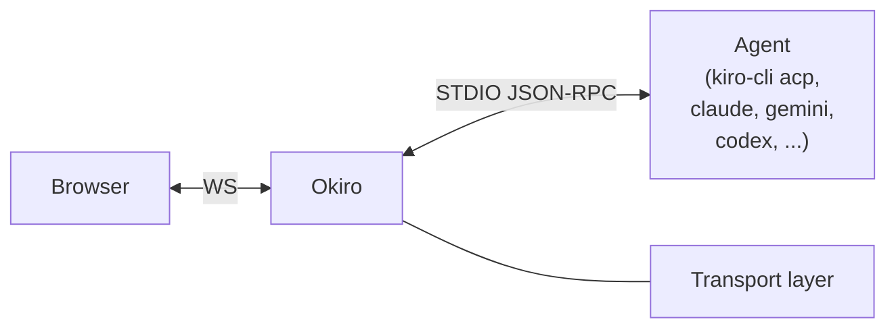

# Architecture and layout

## Diagram



- One browser WebSocket connection = one Okiro session = one freshly spawned agent subprocess = one ACP session.
- Okiro binds loopback by default; `okiro init` also offers `0.0.0.0` for trusted-LAN setups. Public reachability can be delegated to an existing Cloudflare Tunnel on your network.
- The web UI is a React + Tailwind v4 app under `ui/`. The `build.rs` step runs the Vite build; the compiled bundle is baked into the binary via `rust-embed` so the release binary stays self-contained.

## File layout

```
Okiro/
├── Cargo.toml
├── Cargo.lock
├── CHANGELOG.md
├── LICENSE
├── build.rs                    # runs `npm ci` + `npm run build` in ui/
├── assets/                     # logo (Okiro.png) and source artwork (Okiro.af)
├── docs/                       # long-form documentation (wire protocol, etc.)
├── src/
│   ├── main.rs                 # entry, module wiring, transport dispatch
│   ├── config.rs               # on-disk config and interactive setup
│   ├── agent.rs                # ACP subprocess wrapper and JSON-RPC framing
│   ├── session.rs              # session resume and stale-lock recovery
│   ├── http.rs                 # cloudflared transport, UI assets, /state, /history
│   └── ws.rs                   # per-WS session loop and agent-message dispatch
├── ui/                         # React UI (Vite, TS, Tailwind v4, shadcn)
│   ├── index.html
│   ├── package.json            # UI version lives here
│   ├── vite.config.ts
│   └── src/
│       ├── App.tsx
│       ├── main.tsx
│       ├── index.css
│       ├── types.ts            # wire-protocol and state types
│       ├── hooks/useOkiro.ts   # store, WS lifecycle, state sync
│       ├── features/           # TabBar, LogPane, InputRow, ...
│       ├── components/         # CopyButton + shadcn primitives
│       └── lib/                # utils, time helpers
```

## Configuration reference

`~/.okiro/config.json`:

```json
{
  "transports": [{ "kind": "cloudflared", "bind": "127.0.0.1:9510" }],
  "agent_cmd": "kiro-cli",
  "agent_args": ["acp"]
}
```

- `transports`: list of transport entries. Each entry is internally tagged by `kind`. Only `"cloudflared"` is implemented today; running more than one entry at once is not yet supported, so keep the list at a single element. The list shape is future-proofing for adding Telegram and others later (see Roadmap).
- `transports[].kind = "cloudflared"`: serves HTTP + WebSocket on `bind`, for an external tunnel.
- `transports[].bind` (cloudflared only): local bind address. Default is loopback; `okiro init` offers `0.0.0.0:9510` if you want LAN reach. Okiro has no auth of its own today, so anything non-loopback relies on Cloudflare Access, or your LAN being trusted.
- `agent_cmd`: command to launch the ACP agent. Either a bare name, resolved via `$PATH`, or an absolute path. For Kiro use `kiro-cli` with args `["acp"]`.
