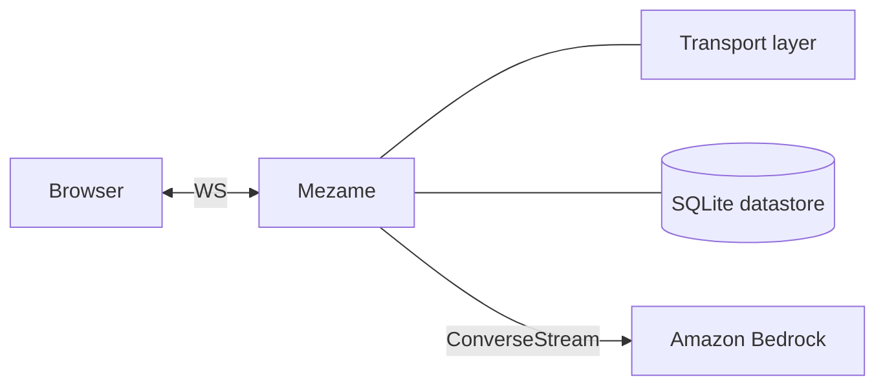

# Architecture and layout

## Diagram


```mermaid
flowchart LR
  browser[Browser]
  mezame["Mezame"]
  transport["Transport layer"]
  store[("SQLite datastore")]
  bedrock["Amazon Bedrock"]

  browser <-- WS --> mezame
  mezame --- transport
  mezame --- store
  mezame -- ConverseStream --> bedrock
```

- One conversation is one session, owned by a hub. Many browser WebSockets can
  attach to the same hub at once, and the same conversation stays in sync across
  phone, laptop, and desktop. A hub is built when the first browser attaches and
  stays warm for a grace window (30s) after the last one detaches, so a reload
  or a transient drop reattaches to the session that was already running. A turn
  still in flight holds that teardown off, up to a cap. The registry holds at
  most 128 hubs; a new session past that is answered 503 until a grace window
  frees a slot, and a live session is always joinable. See `src/hub.rs`.
- What produces a turn sits behind one trait, `backend::Backend`, with six
  operations: run a turn, cancel it, answer a permission request, change the
  model, report the transcript, shut down. The hub owns the wire and knows
  nothing else about it. With a Bedrock profile in the datastore a session
  gets `turn::LoopBackend`, which runs each turn against a
  `provider::Provider`; the one provider is `provider::bedrock`, which calls
  `ConverseStream` through the AWS SDK and normalises its event stream into
  text, reasoning, a stop reason and token counts. The conversation lives in
  `conversation::Conversation`, carried from turn to turn with a cache point
  on the last user message, and the system prompt is assembled in `prompt`.
  Every turn is written to the datastore as it happens (the prompt before the
  request, the reply after it), and a hub built later, after a reload past
  the grace window or a restart, rebuilds the conversation from its rows.
  Without a profile a session gets `EchoBackend`, which returns the text it
  was given, so the transport can be exercised with no AWS account; the echo
  persists nothing.
- Mezame binds loopback by default; `mezame init` also offers `0.0.0.0` for
  trusted-LAN setups. Public reachability can be delegated to an existing
  Cloudflare Tunnel on your network. Two checks in `src/guard.rs` keep pages
  from other sites out of a loopback Mezame: every request must name a host
  Mezame serves in `Host`, and an upgrade or a write must come from a page
  Mezame served, read from `Origin` or, when a request carries none, judged
  by `Sec-Fetch-Site`. Behind them sits the login: every route but the UI
  shell, `/login` and `/me` requires the session cookie, and each account
  reaches only its own sessions.
- The web UI is a React + Tailwind v4 app under `ui/`. The `build.rs` step runs
  the Vite build; the compiled bundle is baked into the binary via `rust-embed`
  so the release binary stays self-contained.

## File layout

```
Mezame/
├── Cargo.toml
├── Cargo.lock
├── CHANGELOG.md
├── LICENSE
├── build.rs                    # runs `npm ci` + `npm run build` in ui/
├── assets/                     # logo (Mezame.png) and source artwork (Mezame.af)
├── docs/                       # long-form documentation (wire protocol, etc.)
├── benches/                    # CodSpeed benchmarks over the pure helpers
├── src/
│   ├── main.rs                 # thin CLI shim; calls mezame::run()
│   ├── lib.rs                  # CLI entry (run/help/version), module wiring, transport dispatch
│   ├── auth.rs                 # passwords (argon2id), the session cookie, the login limiter
│   ├── backend.rs              # the Backend seam, transcript types, the EchoBackend
│   ├── config.rs               # the on-disk settings file and the paths under ~/.mezame
│   ├── conversation.rs         # canonical blocks, attachment limits, the per-session Conversation
│   ├── guard.rs                # the Host allowlist and the Origin/Sec-Fetch-Site check
│   ├── history.rs              # the transcript entries a stored message row stands for
│   ├── hub.rs                  # multi-attach session hub: one session, many browsers
│   ├── http.rs                 # cloudflared transport, UI assets, login, /state, /sessions, /history
│   ├── init.rs                 # mezame init, the first-start bootstrap, the user commands
│   ├── prompt.rs               # the system prompt: preamble, static text, the date line
│   ├── provider/
│   │   ├── mod.rs              # the Provider trait, TurnEvent, ThinkingMode, LoopSettings
│   │   └── bedrock.rs          # ConverseStream: request builder, normaliser, error classifier
│   ├── store/
│   │   ├── mod.rs              # the Store trait and its rows
│   │   ├── sqlite.rs           # the SQLite implementation, on its own thread
│   │   ├── crypto.rs           # the master key, the derived keys, the credential cipher
│   │   └── migrations/         # numbered SQL, applied forward-only at open
│   ├── turn.rs                 # LoopBackend: one turn against a Provider, cancel, idle timeout, the writes
│   ├── ws.rs                   # the upgrade, the per-attach loop, the client command set
│   └── unix.rs                 # tiny Unix FFI helpers (kill, setsid)
├── tests/
│   ├── live_bedrock.rs         # #[ignore] smoke cases against a real model, run by hand
│   └── support/                # ScriptedBackend and ScriptedProvider, shared by the integration tests
├── ui/                         # React UI (Vite, TS, Tailwind v4, shadcn)
│   ├── index.html
│   ├── package.json            # UI version lives here
│   ├── vite.config.ts
│   └── src/
│       ├── App.tsx
│       ├── main.tsx
│       ├── index.css
│       ├── types.ts            # wire-protocol and state types
│       ├── hooks/useMezame.ts   # store, WS lifecycle, the server's session list
│       ├── features/           # SideBar, LogPane, InputRow, LoginGate, ...
│       ├── components/         # CopyButton + shadcn primitives
│       └── lib/                # apiFetch, the auth state, settings, helpers
```

## Configuration reference

`~/.mezame/config.json`:

```json
{
  "version": 2,
  "transports": [
    { "kind": "cloudflared", "bind": "127.0.0.1:9510", "hosts": ["mezame.example.com"] }
  ],
  "datastore": { "backend": "sqlite" },
  "public_url": "https://mezame.example.com",
  "models": ["global.anthropic.claude-haiku-4-5-20251001-v1:0"]
}
```

- `version`: always `2` for this release. A file without it, or with another
  value, is refused at startup with one line pointing at `mezame init`, which
  rewrites the file at version 2 and keeps the hosts.
- `transports`: list of transport entries. Each entry is internally tagged by
  `kind`. Only `"cloudflared"` is implemented today, and running more than one
  entry at once is not yet supported. Keep the list at a single element. The
  list shape leaves room for Telegram and others later (see Roadmap).
- `transports[].kind = "cloudflared"`: serves HTTP + WebSocket on `bind`, for an
  external tunnel.
- `transports[].bind` (cloudflared only): local bind address. Default is
  loopback; `mezame init` offers `0.0.0.0:9510` if you want LAN reach, and
  `mezame init --bind ADDR` writes the file with no prompt. The login gates
  every route on any bind; on a plain-HTTP non-loopback bind the cookie
  crosses the network readable, so a public hostname belongs behind a tunnel
  that brings TLS.
- `transports[].hosts` (cloudflared only, optional): the hostnames Mezame
  answers to besides IP addresses, `localhost`, `.localhost` and `.local`
  names, and the host part of `bind`. A tunnel or proxy passes the public
  hostname through in `Host`, and a request naming a hostname that is in none
  of those sets is answered 421, so list the public hostname here. A browser
  page at one of these names is also accepted as the origin of an upgrade or a
  write, whatever the proxy rewrote `Host` to. Absent means no extra names;
  `mezame init` writes none on a fresh file and keeps the list a readable
  existing file holds when it rewrites one.
- `datastore` (optional, default `{"backend": "sqlite"}`): which backend holds
  the persistent state. `sqlite` is the one value this release accepts; the
  key exists so a second backend is a value and an implementation, not a
  schema change.
- `public_url` (optional): the URL browsers reach Mezame at when a tunnel or
  proxy fronts it. An `https://` value marks the session cookie `Secure`.
- `models` (optional, default empty): the model ids the browser's picker
  offers besides the profile's own model.

The Bedrock model, region and profile are not in this file: `mezame init
--model ID [--region R] [--profile P]` writes them to the datastore, the
model as the global profile row and the region and profile as one encrypted
credential row. A file still carrying the `bedrock` section an earlier
release wrote is refused at startup with a pointer at `mezame init`, which
drops it. The `thinking`, `thinking_budget` and `max_output_tokens` overrides
the section carried are not settable in this release: the mode follows the
model (`adaptive` for the Claude 4.6 line and later, `enabled` with a budget
for the models before it), the budget is 4096 and the reply ceiling 16384,
until a later phase adds a profile editor.

Credentials for AWS itself are never stored. The SDK finds them where the
AWS CLI does: `~/.aws/credentials` and `~/.aws/config` (including SSO and
`credential_process`), or `AWS_ACCESS_KEY_ID`, `AWS_SECRET_ACCESS_KEY` and
`AWS_SESSION_TOKEN`, or `AWS_BEARER_TOKEN_BEDROCK` for a Bedrock API key.

Keys this version does not know are ignored and left on disk untouched, so a
file written by an earlier release loads with no edit and no re-run of
`mezame init`.

`~/.mezame`, and any missing parent, is created owner-only (`0700`) on Unix.
`config.json` is written `0600` through a fresh temporary sibling renamed
into place, so a symlink at the target is replaced rather than written
through and a reader never sees a partial file; `mezame.db` and `master.key`
are created `0600` too, the key through an exclusive sibling published with a
hard link so an existing key is never overwritten. The directory must be
writable by the account Mezame runs as.

## Data model

One SQLite file, `~/.mezame/mezame.db`, in WAL mode, opened by a single
store thread the async side reaches over a channel. Migrations are numbered
SQL files under `src/store/migrations/`, applied forward-only at open, each
in one transaction; a database from a later release is refused. The tables:

- `users`: name, argon2id password hash, role, session epoch, settings.
- `workspaces`: a user's named roots; the default one is created at their
  first session when the server's directory is eligible.
- `sessions`: one per conversation, owned by a user, with title and
  archival timestamps.
- `messages`: one row per side of an exchange, the blocks as JSON, the user
  entry text, the token counts, and a flag for content the model refused.
- `credentials`: provider credentials, the payload encrypted with a key
  derived from `master.key` and the row id as associated data.
- `profiles`: which model runs and which credential signs for it; one
  global row today.
- `grants`, `mcp_grants`, `mcp_servers`, `memories`: seats for later
  phases, created now so the schema needs no rewrite.
