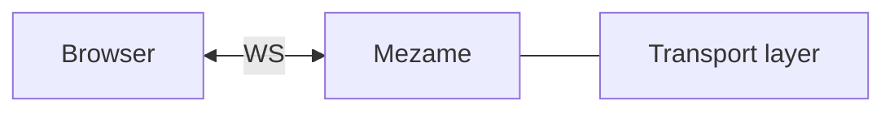

# Architecture and layout

## Diagram


```mermaid
flowchart LR
  browser[Browser]
  mezame["Mezame"]
  transport["Transport layer"]

  browser <-- WS --> mezame
  mezame --- transport
```

- One conversation is one session, owned by a hub. Many browser WebSockets can
  attach to the same hub at once, and the same conversation stays in sync across
  phone, laptop, and desktop. A hub is built when the first browser attaches and
  stays warm for a grace window (30s) after the last one detaches, so a reload
  or a transient drop reattaches to the session that was already running. A turn
  still in flight holds that teardown off, up to a cap. See `src/hub.rs`.
- What produces a turn sits behind one trait, `backend::Backend`, with six
  operations: run a turn, cancel it, answer a permission request, change the
  model, report the transcript, shut down. The hub owns the wire and knows
  nothing else about it. The 0.14.0-alpha.1 release ships an `EchoBackend` that
  answers with the text it was given.
- Mezame binds loopback by default; `mezame init` also offers `0.0.0.0` for
  trusted-LAN setups. Public reachability can be delegated to an existing
  Cloudflare Tunnel on your network.
- The web UI is a React + Tailwind v4 app under `ui/`. The `build.rs` step runs
  the Vite build; the compiled bundle is baked into the binary via `rust-embed`
  so the release binary stays self-contained.

## File layout

```
Mezame/
├── Cargo.toml
├── Cargo.lock
├── CHANGELOG.md
├── LICENSE
├── build.rs                    # runs `npm ci` + `npm run build` in ui/
├── assets/                     # logo (Mezame.png) and source artwork (Mezame.af)
├── docs/                       # long-form documentation (wire protocol, etc.)
├── benches/                    # CodSpeed benchmarks over the pure helpers
├── src/
│   ├── main.rs                 # thin CLI shim; calls mezame::run()
│   ├── lib.rs                  # CLI entry (run/help/version), module wiring, transport dispatch
│   ├── backend.rs              # the Backend seam, transcript types, the shipped EchoBackend
│   ├── config.rs               # on-disk settings and interactive setup
│   ├── hub.rs                  # multi-attach session hub: one session, many browsers
│   ├── http.rs                 # cloudflared transport, UI assets, /state, /history
│   ├── ws.rs                   # the upgrade, the per-attach loop, the client command set
│   └── unix.rs                 # tiny Unix FFI helpers (kill, setsid)
├── tests/
│   └── support/                # ScriptedBackend, shared by the integration tests
├── ui/                         # React UI (Vite, TS, Tailwind v4, shadcn)
│   ├── index.html
│   ├── package.json            # UI version lives here
│   ├── vite.config.ts
│   └── src/
│       ├── App.tsx
│       ├── main.tsx
│       ├── index.css
│       ├── types.ts            # wire-protocol and state types
│       ├── hooks/useMezame.ts   # store, WS lifecycle, state sync
│       ├── features/           # SideBar, LogPane, InputRow, ...
│       ├── components/         # CopyButton + shadcn primitives
│       └── lib/                # utils, time helpers
```

## Configuration reference

`~/.mezame/config.json`:

```json
{
  "transports": [{ "kind": "cloudflared", "bind": "127.0.0.1:9510" }]
}
```

- `transports`: list of transport entries. Each entry is internally tagged by
  `kind`. Only `"cloudflared"` is implemented today, and running more than one
  entry at once is not yet supported. Keep the list at a single element. The
  list shape leaves room for Telegram and others later (see Roadmap).
- `transports[].kind = "cloudflared"`: serves HTTP + WebSocket on `bind`, for an
  external tunnel.
- `transports[].bind` (cloudflared only): local bind address. Default is
  loopback; `mezame init` offers `0.0.0.0:9510` if you want LAN reach. Mezame
  has no auth of its own today. Anything non-loopback relies on Cloudflare
  Access, or on your LAN being trusted.

Keys this version does not know are ignored and left on disk untouched, so a
file written by an earlier release loads with no edit and no re-run of
`mezame init`.
