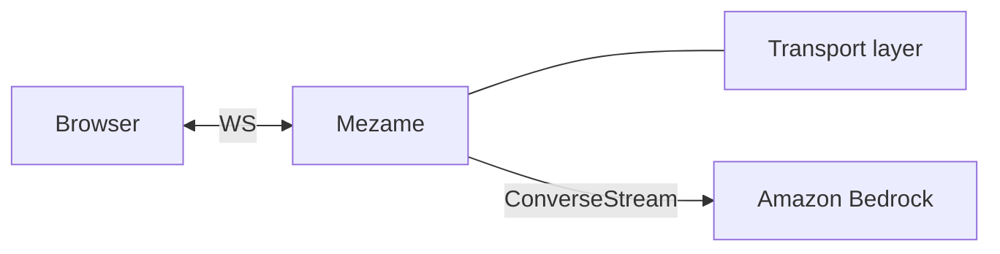

# Architecture and layout

## Diagram


```mermaid
flowchart LR
  browser[Browser]
  mezame["Mezame"]
  transport["Transport layer"]
  bedrock["Amazon Bedrock"]

  browser <-- WS --> mezame
  mezame --- transport
  mezame -- ConverseStream --> bedrock
```

- One conversation is one session, owned by a hub. Many browser WebSockets can
  attach to the same hub at once, and the same conversation stays in sync across
  phone, laptop, and desktop. A hub is built when the first browser attaches and
  stays warm for a grace window (30s) after the last one detaches, so a reload
  or a transient drop reattaches to the session that was already running. A turn
  still in flight holds that teardown off, up to a cap. The registry holds at
  most 128 hubs; a new session past that is answered 503 until a grace window
  frees a slot, and a live session is always joinable. See `src/hub.rs`.
- What produces a turn sits behind one trait, `backend::Backend`, with six
  operations: run a turn, cancel it, answer a permission request, change the
  model, report the transcript, shut down. The hub owns the wire and knows
  nothing else about it. With a `bedrock` section in the configuration a
  session gets `turn::LoopBackend`, which runs each turn against a
  `provider::Provider`; the one provider is `provider::bedrock`, which calls
  `ConverseStream` through the AWS SDK and normalises its event stream into
  text, reasoning, a stop reason and token counts. The conversation lives in
  `conversation::Conversation`, carried from turn to turn with a cache point
  on the last user message, and the system prompt is assembled in `prompt`.
  Without that section a session gets `EchoBackend`, which returns the text it
  was given, so the transport can be exercised with no account.
- Mezame binds loopback by default; `mezame init` also offers `0.0.0.0` for
  trusted-LAN setups. Public reachability can be delegated to an existing
  Cloudflare Tunnel on your network. Two checks in `src/guard.rs` keep pages
  from other sites out of a loopback Mezame: every request must name a host
  Mezame serves in `Host`, and an upgrade or a write must come from a page
  Mezame served, read from `Origin`. Neither needs to know who the user is.
- The web UI is a React + Tailwind v4 app under `ui/`. The `build.rs` step runs
  the Vite build; the compiled bundle is baked into the binary via `rust-embed`
  so the release binary stays self-contained.

## File layout

```
Mezame/
├── Cargo.toml
├── Cargo.lock
├── CHANGELOG.md
├── LICENSE
├── build.rs                    # runs `npm ci` + `npm run build` in ui/
├── assets/                     # logo (Mezame.png) and source artwork (Mezame.af)
├── docs/                       # long-form documentation (wire protocol, etc.)
├── benches/                    # CodSpeed benchmarks over the pure helpers
├── src/
│   ├── main.rs                 # thin CLI shim; calls mezame::run()
│   ├── lib.rs                  # CLI entry (run/help/version), module wiring, transport dispatch
│   ├── backend.rs              # the Backend seam, transcript types, the EchoBackend
│   ├── config.rs               # on-disk settings, the `bedrock` section, interactive setup
│   ├── conversation.rs         # canonical blocks, attachment limits, the per-session Conversation
│   ├── guard.rs                # the Host allowlist and the Origin check, ahead of every route
│   ├── hub.rs                  # multi-attach session hub: one session, many browsers
│   ├── http.rs                 # cloudflared transport, UI assets, /state, /history
│   ├── prompt.rs               # the system prompt: preamble, static text, the date line
│   ├── provider/
│   │   ├── mod.rs              # the Provider trait, TurnEvent, ThinkingMode, LoopSettings
│   │   └── bedrock.rs          # ConverseStream: request builder, normaliser, error classifier
│   ├── turn.rs                 # LoopBackend: one turn against a Provider, cancel, idle timeout
│   ├── ws.rs                   # the upgrade, the per-attach loop, the client command set
│   └── unix.rs                 # tiny Unix FFI helpers (kill, setsid)
├── tests/
│   ├── live_bedrock.rs         # #[ignore] smoke cases against a real model, run by hand
│   └── support/                # ScriptedBackend and ScriptedProvider, shared by the integration tests
├── ui/                         # React UI (Vite, TS, Tailwind v4, shadcn)
│   ├── index.html
│   ├── package.json            # UI version lives here
│   ├── vite.config.ts
│   └── src/
│       ├── App.tsx
│       ├── main.tsx
│       ├── index.css
│       ├── types.ts            # wire-protocol and state types
│       ├── hooks/useMezame.ts   # store, WS lifecycle, state sync
│       ├── features/           # SideBar, LogPane, InputRow, ...
│       ├── components/         # CopyButton + shadcn primitives
│       └── lib/                # utils, time helpers
```

## Configuration reference

`~/.mezame/config.json`:

```json
{
  "transports": [
    { "kind": "cloudflared", "bind": "127.0.0.1:9510", "hosts": ["mezame.example.com"] }
  ],
  "bedrock": {
    "model": "global.anthropic.claude-sonnet-5",
    "models": ["global.anthropic.claude-sonnet-5", "global.anthropic.claude-haiku-4-5-20251001-v1:0"],
    "region": "us-east-1",
    "profile": "work"
  }
}
```

- `transports`: list of transport entries. Each entry is internally tagged by
  `kind`. Only `"cloudflared"` is implemented today, and running more than one
  entry at once is not yet supported. Keep the list at a single element. The
  list shape leaves room for Telegram and others later (see Roadmap).
- `transports[].kind = "cloudflared"`: serves HTTP + WebSocket on `bind`, for an
  external tunnel.
- `transports[].bind` (cloudflared only): local bind address. Default is
  loopback; `mezame init` offers `0.0.0.0:9510` if you want LAN reach, and
  `mezame init --bind ADDR` writes the file with no prompt. Mezame has no auth
  of its own today: on a non-loopback bind, every host that can reach the port
  can read the session list from `GET /state`, read any transcript from
  `/history`, attach to any session over `/ws` and overwrite `state.json`
  through `PUT /state`. The `Host` and `Origin` checks stop pages in a browser,
  not a peer with `curl`. Anything non-loopback relies on Cloudflare Access
  gating the public hostname and on every host on the network segment being
  trusted, because Access never sees the LAN port.
- `transports[].hosts` (cloudflared only, optional): the hostnames Mezame
  answers to besides IP addresses, `localhost`, `.localhost` and `.local`
  names, and the host part of `bind`. A tunnel or proxy passes the public
  hostname through in `Host`, and a request naming a hostname that is in none
  of those sets is answered 421, so list the public hostname here. A browser
  page at one of these names is also accepted as the origin of an upgrade or a
  write, whatever the proxy rewrote `Host` to. Absent means no extra names;
  `mezame init` writes none on a fresh file and keeps the list a readable
  existing file holds when it rewrites one.

- `bedrock` (optional): the provider section. Absent, every session answers
  with an echo and startup says so. Present, `model` is required and the rest
  have defaults:
  - `bedrock.model`: the Bedrock model id a new session starts on, for
    example `global.anthropic.claude-sonnet-5`. Only Anthropic ids are
    accepted.
  - `bedrock.models` (default `[model]`): the ids the browser's model picker
    offers. `model` is added when the list omits it.
  - `bedrock.region` (default: the SDK's chain, `AWS_REGION`, then the
    profile's region): the region the runtime endpoint is in. With no region
    anywhere the SDK's last resort is the EC2 metadata service; startup still
    succeeds after that lookup gives up, and the first turn fails naming the
    missing region. Set it here to be sure.
  - `bedrock.profile` (default: the SDK's chain, `AWS_PROFILE`, then
    `default`): the `~/.aws` profile to sign with.
  - `bedrock.thinking` (default: by model rule): `adaptive`, `enabled` or
    `off`. The rule is `adaptive` for the Claude 4.6 line and later and
    `enabled` for the earlier models that take a budget. The Fable and Mythos
    ids always think: `off` sends nothing for them, reasoning still runs and
    bills, and the thought pane stays empty.
  - `bedrock.thinking_budget` (default `4096`, minimum `1024`): the
    reasoning token budget in `enabled` mode.
  - `bedrock.max_output_tokens` (default `16384`): the reply ceiling per
    turn; must exceed `thinking_budget` when a budget is in force.

  Credentials are never in this file. The SDK finds them where the AWS CLI
  does: `~/.aws/credentials` and `~/.aws/config` (including SSO and
  `credential_process`), or `AWS_ACCESS_KEY_ID`, `AWS_SECRET_ACCESS_KEY` and
  `AWS_SESSION_TOKEN`, or `AWS_BEARER_TOKEN_BEDROCK` for a Bedrock API key.

Keys this version does not know are ignored and left on disk untouched, so a
file written by an earlier release loads with no edit and no re-run of
`mezame init`.

`~/.mezame`, and any missing parent, is created owner-only (`0700`) on Unix, and
`config.json` and `state.json` are written `0600`, each through a fresh
temporary sibling renamed into place; an existing directory keeps its mode.
Because the target is never opened for writing, a symlink at `config.json` or
`state.json` is replaced by the rename rather than written through, and the
directory itself must be writable by the account Mezame runs as.
